<div align="center">

# Toolshape Studio

**An agent-native content studio. Screen capture, video editing and visual design in one semantic project — operable by an AI agent as competently as by a human.**

[Architecture](docs/architecture/DIAGRAMS.md) · [PRD](products/studio/PRD-V2.md) · [Agent integration](docs/agent-integration/AGENT-INTEGRATION-GUIDE.md) · [Capabilities](docs/agent-integration/CAPABILITY-CATALOG.md) · [ADRs](docs/adr/) · [Security](docs/security/THREAT-MODEL.md)

</div>

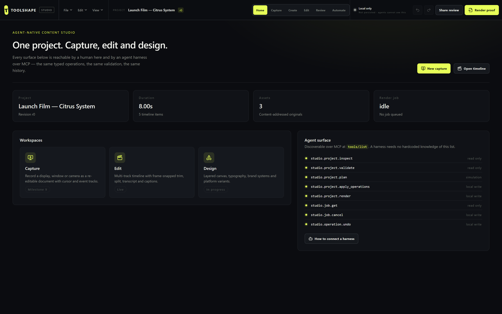

---

## The problem

Every tool in this category — screen recorders, video editors, design suites — is built for a human with a mouse. When an AI agent needs to use one, its only option is to drive the GUI with computer-use: screenshot, guess, click, hope.

That approach throws away everything that makes automation trustworthy. There is no revision check, so the agent silently overwrites work a human did two seconds ago. There is no idempotency, so a retried request renders twice. There is no preview, so nothing can be reviewed before it happens. There is no verification, so "done" means *a model said it looked done*. And it breaks the moment a button moves.

**Toolshape Studio is built the other way around.** The semantic operation surface is the product; the GUI is one adapter over it. A human dragging a trim handle and an agent calling `studio_project_apply_operations` submit the *same typed operation*, through the same validation, into the same history.

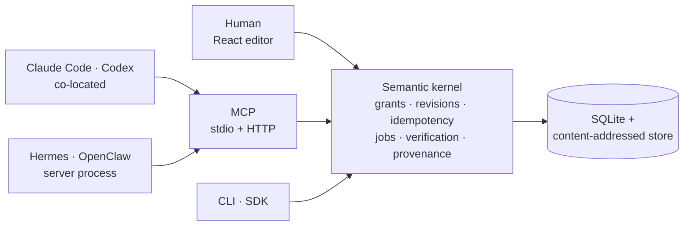

No adapter gets a looser path than any other. That is enforced by [adapter parity tests](packages/studio-mcp/tests/mcp.test.ts), not by convention.

---

## Three pillars, one project

A capture, a video and a design are the same object type with different fields populated — which is why an agent that can operate one can operate all three.

| Pillar | What it does | Status |
|---|---|---|
| **Capture** | Record a display, window or camera as a *re-editable document* — cursor, click, keystroke and window tracks survive as data instead of being flattened into pixels | Specified ([spec](docs/product/CAPTURE-PILLAR.md)) |
| **Edit** | Multi-track timeline, frame-snapped trim and split, transcript-driven cuts, captions, audio mix | **Live** |
| **Design** | Layered canvas, typography, brand systems, platform variants, bulk data binding | In progress |

The capture pillar's structural claim: because click and window events are kept as data, an agent asking to *"zoom on every click in the settings panel"* is resolved **deterministically against the event track**. Against a flat video the same request needs frame-by-frame vision inference and cannot be verified.

See the [pillar feature matrix](docs/product/PILLAR-FEATURE-MATRIX.md) for the full outcome-set analysis against the category references.

---

## The interface

Six workspaces rearrange the same objects. Switching workspace is ephemeral view state — it never advances the project revision.

### Home — projects, stats and the live agent surface


The capability list is rendered from the same definitions the MCP transport advertises, so the dashboard cannot drift from what is actually callable.

### Capture — recording as semantic data


Consent-gated by construction. The recording indicator cannot be suppressed and keystroke capture is off by default — including, and especially, when an agent initiates the session.

### Edit — the timeline

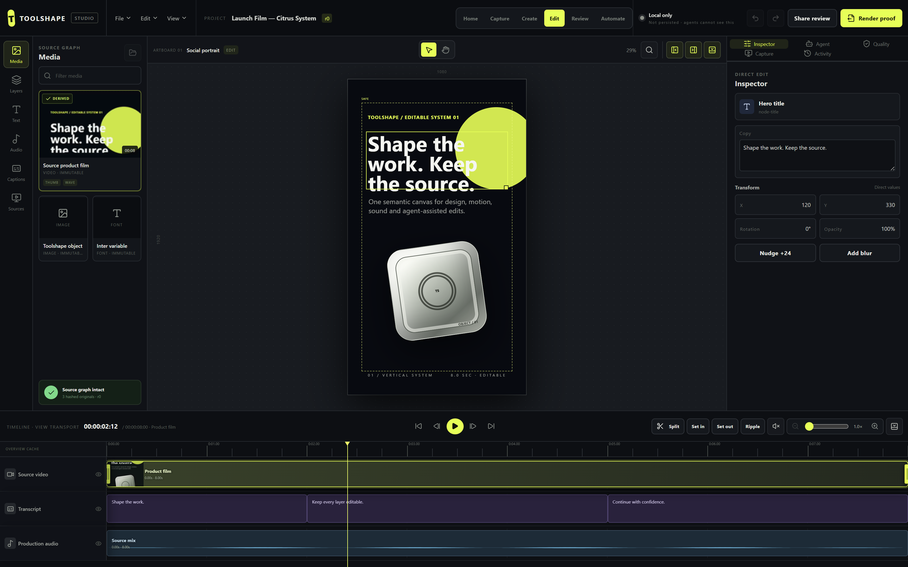

Direct manipulation: click a clip to select it, drag frame-snapped trim handles, scrub the playhead, split at the playhead with `S`. A drag emits **exactly one** `timeline.clip.trim` operation at pointer-up — the identical operation an agent submits.


### Create · Review · Automate

| Create | Review | Automate |
|---|---|---|
| 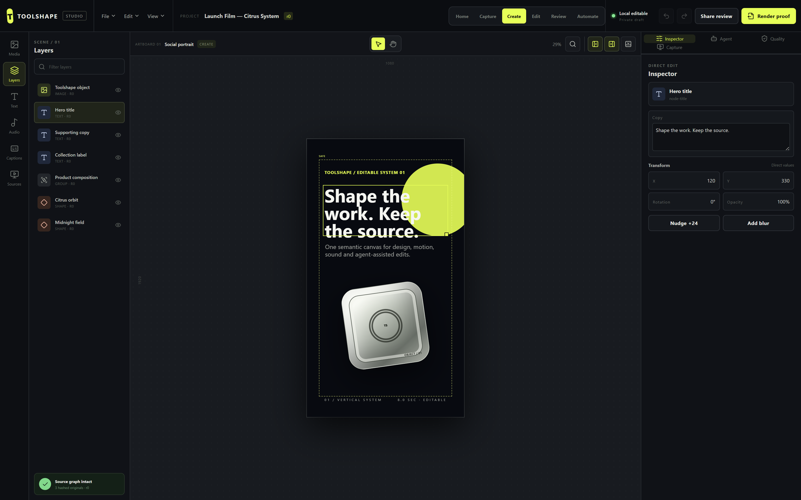 |  | 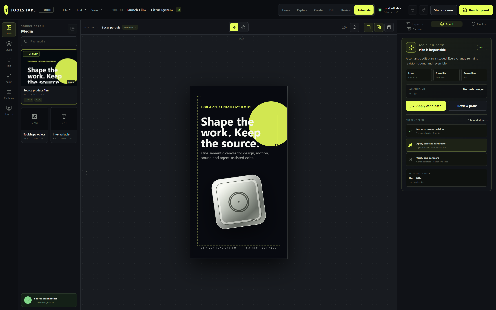 |
| Layered design canvas | Diffs, quality gates, approval | Plans, jobs, harness sessions |

<details>
<summary><b>All panels</b> — click to expand</summary>

| Media | Layers | Text |
|---|---|---|
|  | 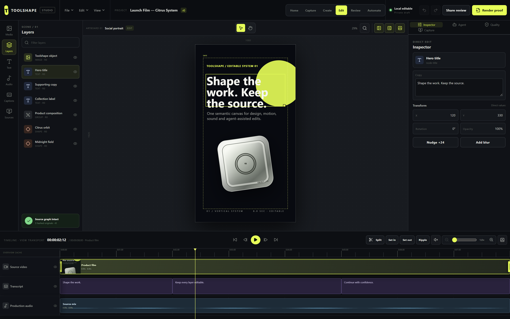 | 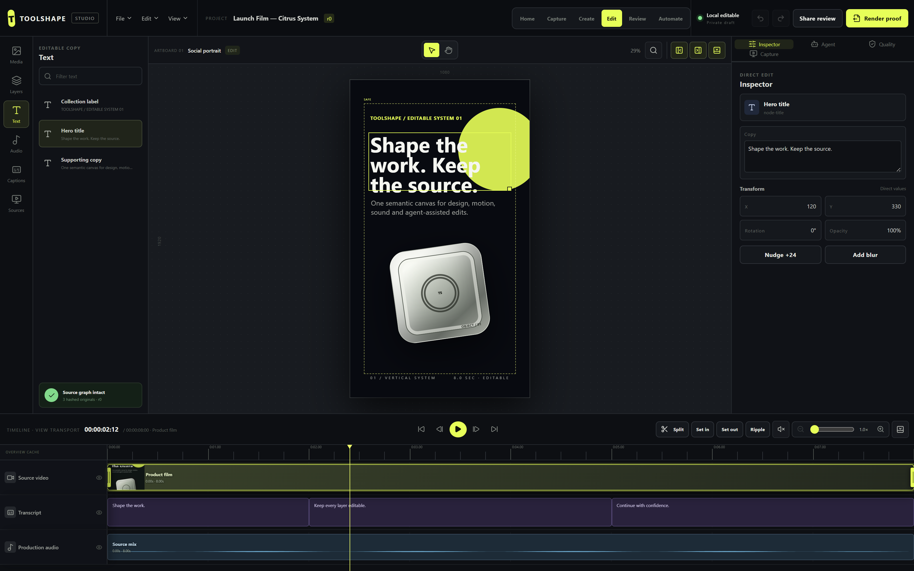 |

| Audio | Captions | Sources |
|---|---|---|
| 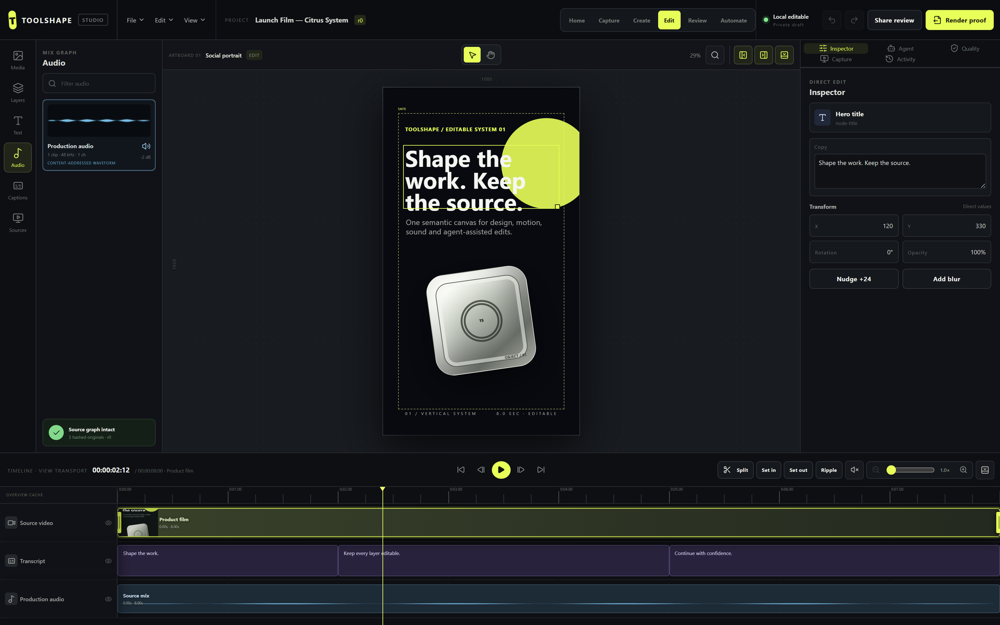 | 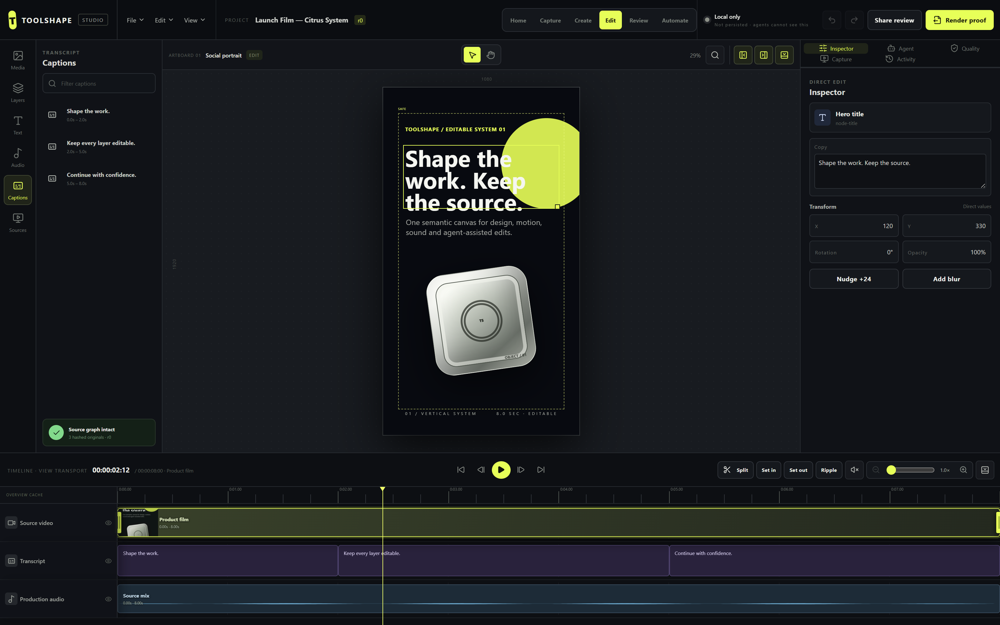 | 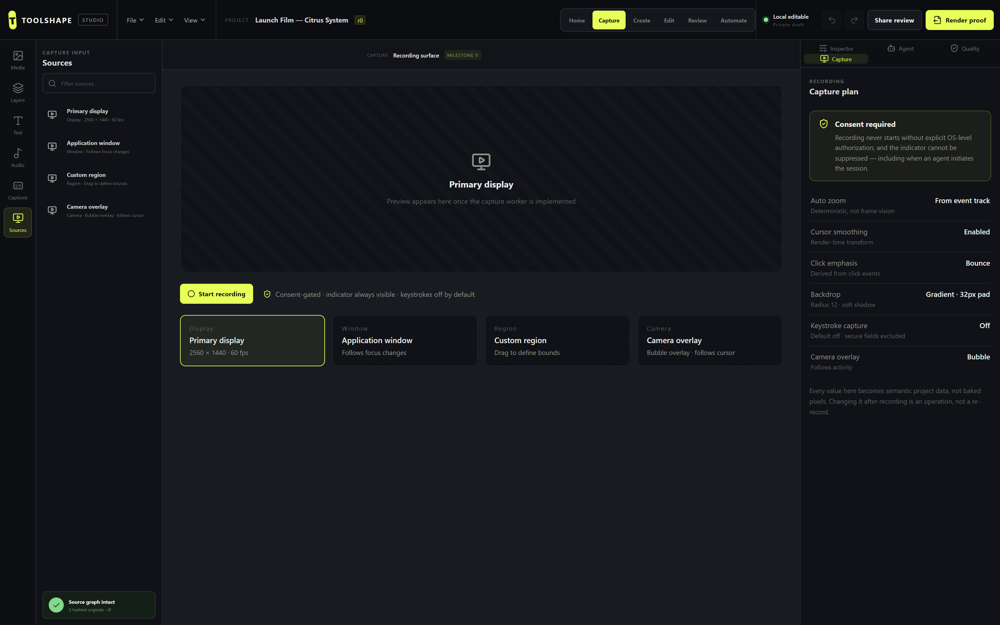 |

| Inspector | Agent | Quality |
|---|---|---|
|  | 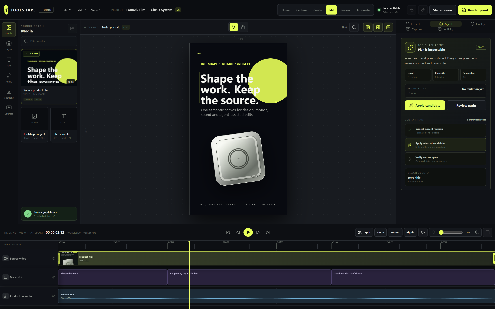 | 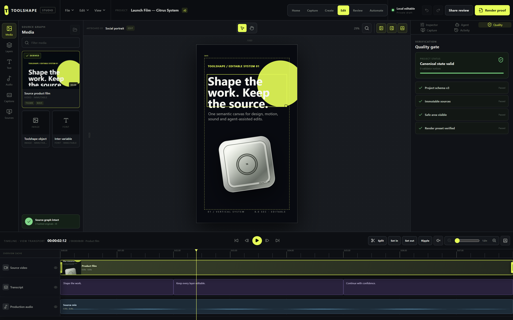 |

| Capture plan | Timeline |
|---|---|
|  | 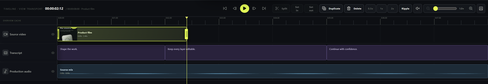 |

These images are regenerated by driving the real application, never pasted in by hand:

```bash
npm run build && npm run docs:screenshots
```

</details>

---

## Connect an agent harness

Start the transport:

```bash
STUDIO_MCP_TOKEN=$(openssl rand -hex 32) npm run mcp:http
```

Any MCP-capable harness can now discover and drive the full surface over `http://127.0.0.1:7777`. For co-located harnesses, `npm run mcp` speaks the same protocol over stdio.

```bash
curl -s http://127.0.0.1:7777/ -H "Authorization: Bearer $STUDIO_MCP_TOKEN" -H "content-type: application/json" -d '{"jsonrpc":"2.0","id":1,"method":"tools/list"}'
```

The agent's control loop is **inspect → plan → apply → verify**:

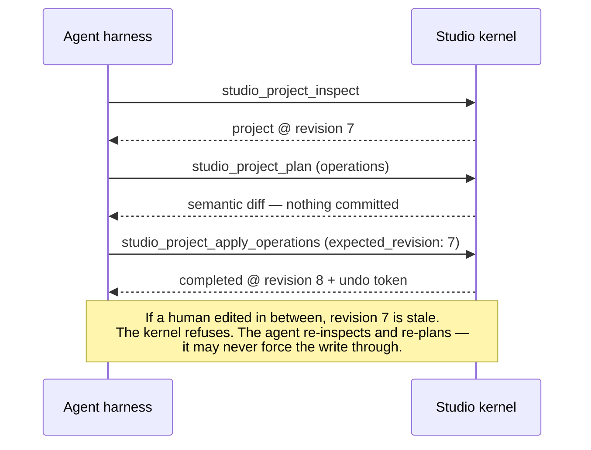

Worked examples and error handling: **[Agent integration guide](docs/agent-integration/AGENT-INTEGRATION-GUIDE.md)**.

### What an agent can call today

| Tool | Capability | Risk |
|---|---|---|
| `studio_project_inspect` | Read canonical state and current revision | read only |
| `studio_project_validate` | Deterministic domain validation | read only |
| `studio_project_plan` | Preview operations as a semantic diff | simulation |
| `studio_project_apply_operations` | Apply typed operations atomically | local write |
| `studio_project_render` | Queue a durable render job | local write |
| `studio_job_get` | Poll progress, stage and outputs | read only |
| `studio_job_cancel` | Cooperative cancellation | local write |
| `studio_operation_undo` | Reverse via a single-use undo token | local write |

Capture capabilities join this list at Milestone 9 with no protocol change.

---

## What makes it trustworthy

**Model output cannot grant authority.** A model's text, an imported document, a web page, and another MCP server's tool description are all *untrusted data*. They can influence a proposal; they can never expand permission. Authorization is deterministic code, re-derived on every call, never cached from an upstream "already approved" claim. There is no instruction anywhere in this system that a model is trusted to obey for safety purposes.

**Concurrency is safe by construction.** Every mutation declares the revision it expects. A mismatch is refused outright — an agent must re-inspect and re-plan rather than overwrite. No locks, no silent loss.

**Retries cannot double-execute.** Idempotency keys are scoped to (actor, capability, target). A replay with the same payload returns the original result; a replay with a *different* payload is a conflict, not a second execution.

**Untrusted media is quarantined before it is trusted.** Imported bytes are signature-checked, written to an ephemeral snapshot, probed from *that snapshot* — never the caller's mutable path, which would be a time-of-check/time-of-use race — and budget-checked before anything reaches the content-addressed store. Rejections are structured and path-free; quarantine is deleted on every outcome including failure.

**Verification is deterministic.** A completed render means the output was probed and matched expected duration, dimensions and codec — not that a model reported success.

**Long work is durable.** Renders return a job reference immediately, persist fractional progress to SQLite, survive process restart, and cancel cooperatively.

Details: [threat model](docs/security/THREAT-MODEL.md) · [security architecture](docs/11-security-secrets-privacy.md) · [trust boundaries](docs/architecture/DIAGRAMS.md#4-trust-boundaries)

---

## Quick start

```bash
npm install
npm test
npm run typecheck
npm run build
npm run dev
```

Verification gates:

```bash
npm run smoke:mcp
npm run smoke:runtime
npm run smoke:cli
npm run smoke:render-job
npm run smoke:media-ingest
npm run qa:browser
npm run render:golden
npm run test:render-cancel
```

`qa:browser` and `docs:screenshots` need `STUDIO_URL` pointing at a running instance.

---

## Repository layout

```text
apps/studio/              React editor shell, QA and smoke scripts
packages/
  studio-domain/          canonical project model, migrations
  studio-engine/          scene graph, timeline, rational time, validation
  studio-kernel/          operation dispatch, grants, revisions, idempotency
  studio-persistence/     SQLite repository, content-addressed asset store
  studio-media/           ingestion, quarantine, probing, derivatives
  studio-render/          render planning, durable job worker
  studio-sdk/             public schema-validated contract
  studio-cli/             JSON stdin/stdout adapter
  studio-mcp/             MCP transport — stdio + HTTP
docs/                     architecture, ADRs, product specs, security
specs/                    JSON Schema public contracts
fixtures/                 golden project
```

---

## Status

**Milestone 7 of 10.**

Shipped: unified project model, typed operations with revisions and idempotency, atomic batches, undo/redo, SQLite restart recovery, byte-sniffed content-addressed imports, real media probing with quarantine and resource budgets, verified proxy/thumbnail/waveform derivatives, durable render jobs with progress and cancellation, direct timeline manipulation, schema-valid CLI/SDK adapters, the MCP network transport, and the super-app shell.

Not yet built, and not claimed: the capture worker, the policy engine, the secret broker, network egress, at-rest encryption, sandboxed codec execution, the Tauri desktop shell, and real-time collaboration. The [threat model](docs/security/THREAT-MODEL.md) enumerates these explicitly as non-claims rather than leaving them ambiguous.

Roadmap: [PRD v2 §10](products/studio/PRD-V2.md) · [delivery plan](docs/18-delivery-plan.md) · [non-goals](docs/19-non-goals.md)

---

## Context

Toolshape Studio is one of two products built on a shared agent-native platform; the other is Toolshape Voice. The portfolio architecture, the agent-native constitution, and the ChaseOS supervisory model are described in the [handover pack](docs/HANDOVER-PACK.md) and the numbered documents under [`docs/`](docs/).

Studio runs standalone. ChaseOS is a supervisory layer for policy, budgets and scheduling across applications — it is never a second source of truth for Studio's domain state, and no part of Studio requires it.

---

## Clean-room

Toolshape Studio targets the *outcome sets* of established capture, video and design tools. It does not copy their code, assets, templates, wording, iconography or layout — regardless of how permissively any of them is licensed. Our policy is deliberately stricter than the licences we could otherwise rely on. See [`AGENTS.md`](AGENTS.md) and the [pillar feature matrix](docs/product/PILLAR-FEATURE-MATRIX.md).

`Toolshape` and `Toolshape Studio` are provisional engineering names. They have passed only a preliminary exact-name scan ([`naming/COLLISION-SCAN.md`](naming/COLLISION-SCAN.md)) and are **not** trademark, domain, package-registry or app-store cleared.

Licensing and product-strategy material in this repository is an engineering decision aid, not legal advice.
