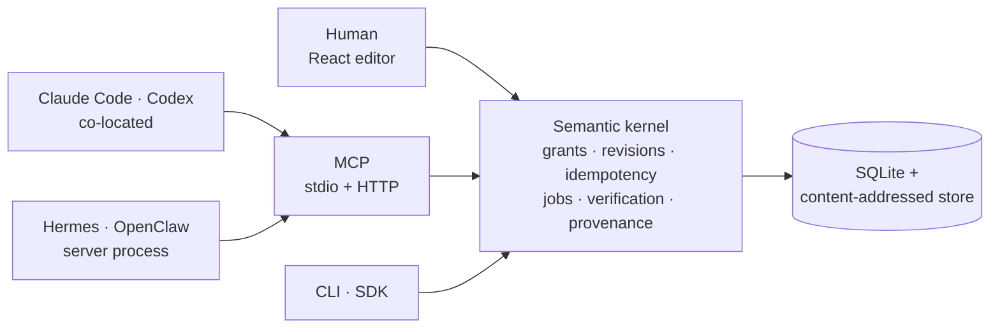
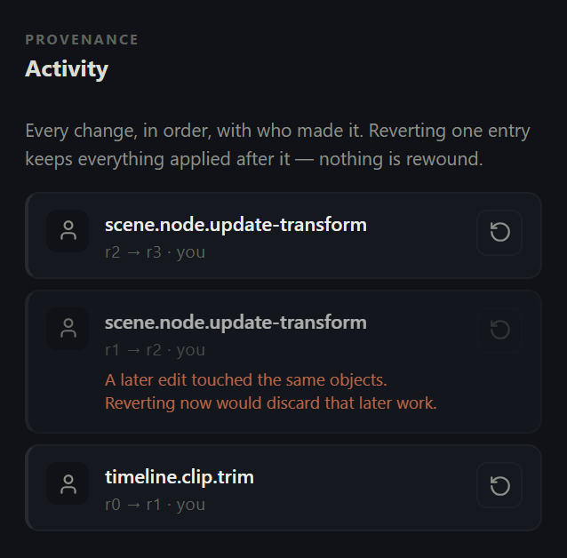
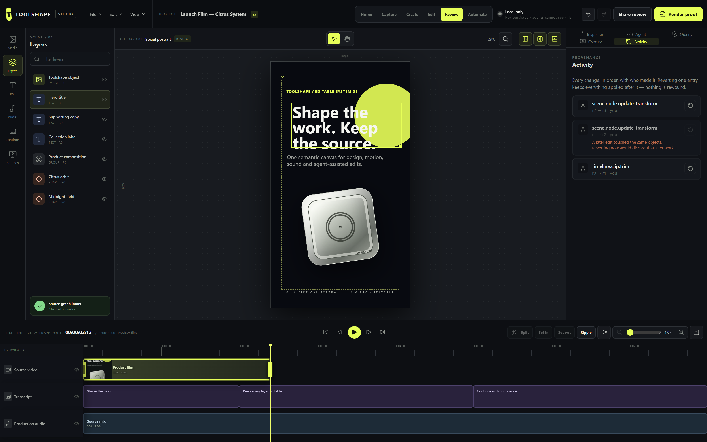
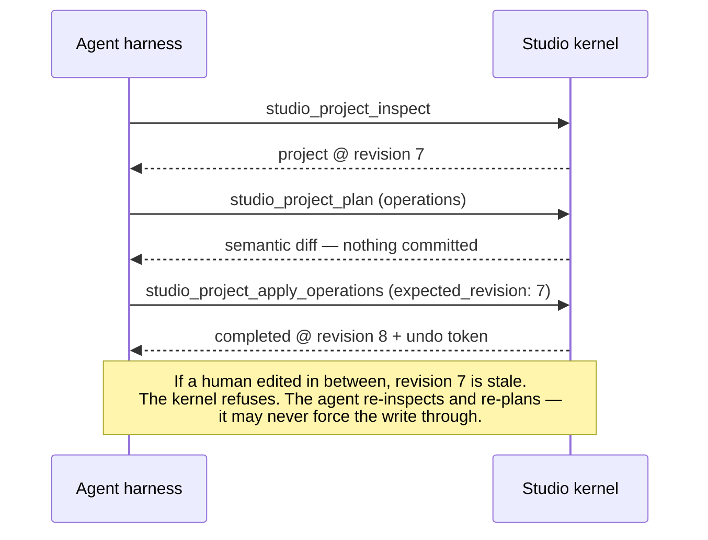

<div align="center">

# Toolshape Studio

### Studio-quality content, produced by agents, finished by you.

**Screen recording, video editing and visual design in one project — the first content studio an AI agent can operate as competently as a person.**

[Roadmap](docs/product/ROADMAP.md) · [Positioning](docs/product/POSITIONING.md) · [Architecture](docs/architecture/DIAGRAMS.md) · [PRD](products/studio/PRD-V2.md) · [Agent integration](docs/agent-integration/AGENT-INTEGRATION-GUIDE.md) · [Capabilities](docs/agent-integration/CAPABILITY-CATALOG.md) · [ADRs](docs/adr/) · [Security](docs/security/THREAT-MODEL.md)

</div>


<div align="center">
<sub><b>Real recording, generated by driving the app.</b> An agent rewrites the headline twice over MCP; the canvas and history update live. Then a person nudges a layer. Every change is attributed — <b>agent</b> or <b>you</b> — in one history, and the two agent edits are marked non-revertible because later work touched the same object. Regenerate with <code>npm run docs:demo</code>.</sub>
</div>

---

## Who it's for

**Content creators and marketers who work in screen capture** — product demos, feature announcements, tutorials, onboarding walkthroughs, launch videos, and the platform variants of all of them.

The defining trait of that work isn't that it's difficult. It's that it's **repetitive precision work, at relentless volume.** Record the demo. Cut the dead air. Zoom on the click. Add captions. Apply the brand. Export for four platforms at three aspect ratios. Do it again next week.

Every one of those steps is rule-governed and verifiable — exactly the shape of work an agent should do, and exactly what today's tools force a person to do by hand, because they're built for a mouse.

## The problem

Every tool in this category — screen recorders, video editors, design suites — is built for a human with a mouse. When an AI agent needs to use one, its only option is to drive the GUI with computer-use: screenshot, guess, click, hope.

That approach throws away everything that makes automation trustworthy. There is no revision check, so the agent silently overwrites work a human did two seconds ago. There is no idempotency, so a retried request renders twice. There is no preview, so nothing can be reviewed before it happens. There is no verification, so "done" means *a model said it looked done*. And it breaks the moment a button moves.

**Toolshape Studio is built the other way around.** The semantic operation surface is the product; the GUI is one adapter over it. A human dragging a trim handle and an agent calling `studio_project_apply_operations` submit the *same typed operation*, through the same validation, into the same store and the same revision sequence.

That last part is verified, not asserted — it is what the recording above shows. `npm run smoke:connected` drives a real browser against a real host and proves four things end to end: the editor reports itself connected, a UI edit survives a full page reload, an agent edit over MCP appears in the browser without a manual refresh and attributed to the agent, and a UI write against a revision the agent has moved past is **refused** rather than silently overwriting the agent's work.

```bash
npm run dev:connected
```



No adapter gets a looser path than any other. That is enforced by [adapter parity tests](packages/studio-mcp/tests/mcp.test.ts), not by convention.

---

## Three pillars, one project

A capture, a video and a design are the same object type with different fields populated — which is why an agent that can operate one can operate all three.

### Capture — record a demo that stays editable

What comes out is **not a flat video file**. It's a document that still knows what happened.

| | |
|---|---|
| **Automatic zoom** that follows the action, derived from where you actually clicked | **Styled backdrops** — gradients, solid fills, wallpapers, padding, rounded corners, drop shadows |
| **Smooth cursor motion** with click emphasis and motion blur | **Crop and reframe** to any aspect ratio, zoom plan reflowing to match |
| **Camera overlay** as a bubble that follows the activity | **Speed regions** to accelerate the dull parts, slow the important ones |
| **Redaction** of a window, a region, or a span of keystrokes | **Annotations** from the same layer system the design pillar uses |

Every one of those is adjustable *after* recording, because none of it was ever baked into the pixels. Change the zoom next week without re-recording.

> **The structural claim:** because clicks and window focus are kept as data, an agent asked to *"zoom on every click in the settings panel"* answers by **reading the event log**. Against a flat video the same request needs frame-by-frame vision inference and cannot be verified.

*Status: specified — [spec](docs/product/CAPTURE-PILLAR.md), [roadmap](docs/product/ROADMAP.md)*

### Edit — cut it like a real editor

Multi-track timeline with frame-accurate control: split, trim, move, reorder, ripple delete, duplicate, speed ramp. Transitions and a keyframable effect stack. Auto-captions with styling and timing. Audio with gain, fades, normalisation and ducking. **Transcript-driven editing** — delete a sentence in the text and the video cuts with it.

*Status: **live** — timeline with trim, split, move, reorder, delete, duplicate, merge and rational speed; durable render*

### Design — brand it and ship it everywhere

Layered canvas, typography, shapes and masks, image adjustment. Brand kits applying colours, fonts and logos with hard and soft rules. Templates and reusable components. And the payoff: **one source becomes every platform format**, with hierarchy, safe areas, contrast and text fit preserved — and *checked*, not hoped for.

*Status: in progress*

See the [pillar feature matrix](docs/product/PILLAR-FEATURE-MATRIX.md) for the full outcome-set analysis against the category references, and [positioning](docs/product/POSITIONING.md) for the canonical product language.

---

## The interface

Six workspaces rearrange the same objects. Switching workspace is ephemeral view state — it never advances the project revision.

### Home — projects, stats and the live agent surface


The capability list is rendered from the same definitions the MCP transport advertises, so the dashboard cannot drift from what is actually callable.

### Capture — recording as semantic data


Consent-gated by construction. The recording indicator cannot be suppressed and keystroke capture is off by default — including, and especially, when an agent initiates the session.

### Edit — the timeline


Direct manipulation: click a clip to select it, drag frame-snapped trim handles, scrub the playhead, split at the playhead with `S`. A drag emits **exactly one** `timeline.clip.trim` operation at pointer-up — the identical operation an agent submits.


### Activity — every change, and undo just one of them



Every operation is listed with **who made it — you or an agent** — and what revision it produced. Any single entry can be reversed *without* rewinding what came after it.

This is `git revert`, not `git reset`: the inverse is computed and applied **forward** as a new revision, so both the original edit and its reversal stay in history. Nothing is rewritten.

Two things make it honest rather than magical, and both are visible above:

- **The middle entry is blocked** because a later edit touched the same object. Reverting it would silently discard that newer work, so it's refused with the reason rather than guessed at.
- **Operations whose inverse genuinely doesn't exist** say so. Every timeline and scene edit reverts, including deletion — but creating a caption or a keyframe has no removal operation yet, so those declare the limit instead of failing when you click.

Agents get the identical surface: `studio_project_history` and `studio_operation_revert`.

### Create · Review · Automate

| Create | Review | Automate |
|---|---|---|
|  |  |  |
| Layered design canvas | Diffs, quality gates, approval | Plans, jobs, harness sessions |

<details>
<summary><b>All panels</b> — click to expand</summary>

| Media | Layers | Text |
|---|---|---|
|  |  |  |

| Audio | Captions | Sources |
|---|---|---|
|  |  |  |

| Inspector | Agent | Quality |
|---|---|---|
|  |  |  |

| Activity | | |
|---|---|---|
|  | | |

| Capture plan | Timeline |
|---|---|
|  |  |

These images are regenerated by driving the real application, never pasted in by hand:

```bash
npm run build && npm run docs:screenshots
```

</details>

---

## Connect an agent harness

Start the transport:

```bash
STUDIO_MCP_TOKEN=$(openssl rand -hex 32) npm run mcp:http
```

Any MCP-capable harness can now discover and drive the full surface over `http://127.0.0.1:7777`. For co-located harnesses, `npm run mcp` speaks the same protocol over stdio.

```bash
curl -s http://127.0.0.1:7777/ -H "Authorization: Bearer $STUDIO_MCP_TOKEN" -H "content-type: application/json" -d '{"jsonrpc":"2.0","id":1,"method":"tools/list"}'
```

The agent's control loop is **inspect → plan → apply → verify**:



Worked examples and error handling: **[Agent integration guide](docs/agent-integration/AGENT-INTEGRATION-GUIDE.md)**.

### What an agent can call today

| Tool | Capability | Risk |
|---|---|---|
| `studio_project_inspect` | Read canonical state and current revision | read only |
| `studio_project_validate` | Deterministic domain validation | read only |
| `studio_project_plan` | Preview operations as a semantic diff | simulation |
| `studio_project_apply_operations` | Apply typed operations atomically | local write |
| `studio_project_render` | Queue a durable render job | local write |
| `studio_job_get` | Poll progress, stage and outputs | read only |
| `studio_job_cancel` | Cooperative cancellation | local write |
| `studio_operation_undo` | Reverse via a single-use undo token | local write |
| `studio_project_history` | Every change with actor attribution and per-entry revertibility | read only |
| `studio_operation_revert` | Reverse one past operation, keeping everything after it | local write |

Capture capabilities join this list at Milestone 9 with no protocol change.

---

## What makes it trustworthy

**Model output cannot grant authority.** A model's text, an imported document, a web page, and another MCP server's tool description are all *untrusted data*. They can influence a proposal; they can never expand permission. Authorization is deterministic code, re-derived on every call, never cached from an upstream "already approved" claim. There is no instruction anywhere in this system that a model is trusted to obey for safety purposes.

**Concurrency is safe by construction.** Every mutation declares the revision it expects. A mismatch is refused outright — an agent must re-inspect and re-plan rather than overwrite. No locks, no silent loss.

**Retries cannot double-execute.** Idempotency keys are scoped to (actor, capability, target). A replay with the same payload returns the original result; a replay with a *different* payload is a conflict, not a second execution.

**Untrusted media is quarantined before it is trusted.** Imported bytes are signature-checked, written to an ephemeral snapshot, probed from *that snapshot* — never the caller's mutable path, which would be a time-of-check/time-of-use race — and budget-checked before anything reaches the content-addressed store. Rejections are structured and path-free; quarantine is deleted on every outcome including failure.

**Verification is deterministic.** A completed render means the output was probed and matched expected duration, dimensions and codec — not that a model reported success.

**Long work is durable.** Renders return a job reference immediately, persist fractional progress to SQLite, survive process restart, and cancel cooperatively.

Details: [threat model](docs/security/THREAT-MODEL.md) · [security architecture](docs/11-security-secrets-privacy.md) · [trust boundaries](docs/architecture/DIAGRAMS.md#4-trust-boundaries)

---

## Quick start

```bash
npm install
npm test
npm run typecheck
npm run build
npm run dev             # editor, local kernel only
npm run dev:connected   # editor + MCP host, shared with agents
```

Verification gates:

```bash
npm run smoke:connected   # browser + host: persistence, agent visibility, conflict refusal
npm run smoke:mcp
npm run smoke:runtime
npm run smoke:cli
npm run smoke:render-job
npm run smoke:media-ingest
npm run qa:browser
npm run render:golden
npm run test:render-cancel
```

`qa:browser` and `docs:screenshots` need `STUDIO_URL` pointing at a running instance.

---

## Repository layout

```text
apps/studio/              React editor shell, QA and smoke scripts
packages/
  studio-domain/          canonical project model, migrations
  studio-engine/          scene graph, timeline, rational time, validation
  studio-kernel/          operation dispatch, grants, revisions, idempotency
  studio-persistence/     SQLite repository, content-addressed asset store
  studio-media/           ingestion, quarantine, probing, derivatives
  studio-render/          render planning, durable job worker
  studio-sdk/             public schema-validated contract
  studio-cli/             JSON stdin/stdout adapter
  studio-mcp/             MCP transport — stdio + HTTP
docs/                     architecture, ADRs, product specs, security
specs/                    JSON Schema public contracts
fixtures/                 golden project
```

---

## Status

**Milestone 7 of 10.**

Shipped: unified project model, typed operations with revisions and idempotency, atomic batches, undo/redo, SQLite restart recovery, byte-sniffed content-addressed imports, real media probing with quarantine and resource budgets, verified proxy/thumbnail/waveform derivatives, durable render jobs with progress and cancellation, direct timeline manipulation, schema-valid CLI/SDK adapters, the MCP network transport, and the super-app shell.

Not yet built, and not claimed: the capture worker, the policy engine, the secret broker, network egress, at-rest encryption, sandboxed codec execution, the Tauri desktop shell, and real-time collaboration. The [threat model](docs/security/THREAT-MODEL.md) enumerates these explicitly as non-claims rather than leaving them ambiguous.

**Roadmap: [docs/product/ROADMAP.md](docs/product/ROADMAP.md)** — phased build order for all three pillars, including why agent-native screen capture is achievable without native code first. Also: [PRD v2](products/studio/PRD-V2.md) · [non-goals](docs/19-non-goals.md)

---

## Context

Toolshape Studio is one of two products built on a shared agent-native platform; the other is Toolshape Voice. The portfolio architecture, the agent-native constitution, and the ChaseOS supervisory model are described in the [handover pack](docs/HANDOVER-PACK.md) and the numbered documents under [`docs/`](docs/).

Studio runs standalone. ChaseOS is a supervisory layer for policy, budgets and scheduling across applications — it is never a second source of truth for Studio's domain state, and no part of Studio requires it.

---

## Clean-room

Toolshape Studio targets the *outcome sets* of established capture, video and design tools. It does not copy their code, assets, templates, wording, iconography or layout — regardless of how permissively any of them is licensed. Our policy is deliberately stricter than the licences we could otherwise rely on. See [`AGENTS.md`](AGENTS.md) and the [pillar feature matrix](docs/product/PILLAR-FEATURE-MATRIX.md).

`Toolshape` and `Toolshape Studio` are provisional engineering names. They have passed only a preliminary exact-name scan ([`naming/COLLISION-SCAN.md`](naming/COLLISION-SCAN.md)) and are **not** trademark, domain, package-registry or app-store cleared.

Licensing and product-strategy material in this repository is an engineering decision aid, not legal advice.
