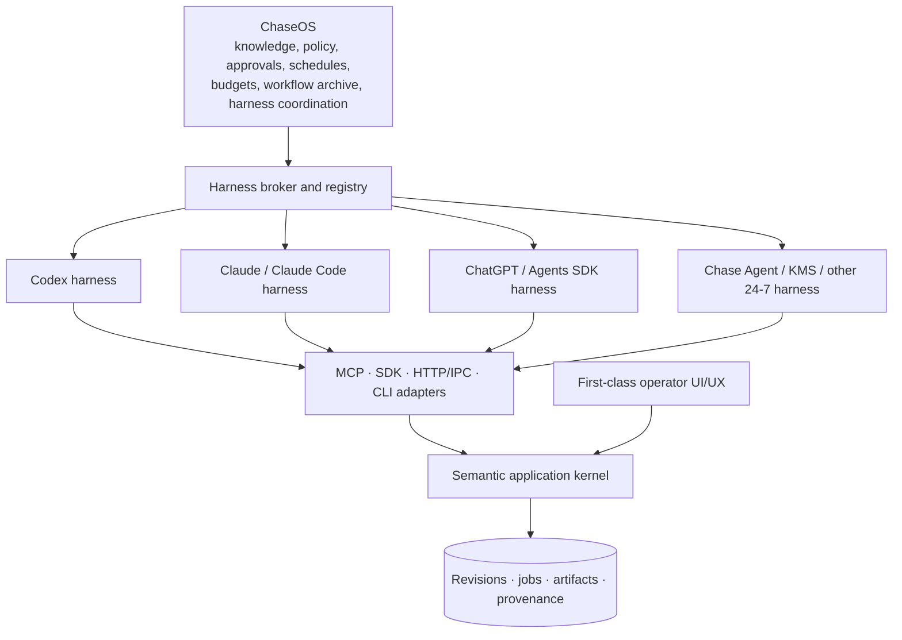

# Toolshape Harness-Native Software Handover — v2

**Status:** implementation-ready architecture and product-definition pack  
**Generated:** 14 July 2026  
**Canonical portfolio model:** one shared platform, two independent products

| Working module | Product | Clean-room category reference |
|---|---|---|
| **Toolshape Voice** | Local-first, system-wide voice dictation, transformation, learning, analytics, and agent control | Wispr Flow-style outcome set |
| **Toolshape Studio** | Unified visual-design and video-editing super app with a first-class human editor and a semantic agent control plane | Canva- and CapCut-style outcome sets |

`Toolshape`, `Toolshape Voice`, and `Toolshape Studio` are provisional engineering names. They passed only a preliminary exact-name web/GitHub scan described in `naming/COLLISION-SCAN.md`. They are **not** trademark, domain, package-registry, company-name, or app-store cleared.

## Current Studio implementation

**Status (2026-07-16): PARTIAL / MILESTONES 1-5 VERIFIED.** This repository now owns a runnable Toolshape Studio seed under `apps/studio/` and `packages/studio-*`. It includes a unified scene/timeline project, typed edit operations, revision and idempotency enforcement, atomic batches, undo/redo, SQLite restart recovery, byte-sniffed content-addressed imports, real video/audio probing, verified proxy/thumbnail/waveform generation, a scalable React editor shell with Create/Edit/Review/Automate arrangements and resolver-backed media evidence across Media, Audio, and timeline panels, schema-valid JSON CLI/SDK adapters, verified PNG/MP4 output, and a durable local render-job lifecycle with persisted progress, cancellation, retry/recovery, and immutable artifact registration.

Run the canonical checks from the repository root:

```powershell
npm install
npm test
npm run typecheck
npm run build
npm run smoke:runtime
npm run smoke:cli
npm run smoke:render-job
npm run smoke:media-ingest
```

For live visual and media QA, start `npm run dev`, set `STUDIO_URL` to the printed local URL, then run `npm run qa:browser`, `npm run render:golden`, and `npm run test:render-cancel`.

The Tauri shell, authenticated local IPC, MCP transport, full drag docking/layout persistence, sandboxed hostile-codec execution, tiled/zoomable waveform caches, signed packaging, crash-proof multi-worker leases, and broad feature parity remain deferred. The current host does not have Rust/Cargo or the MSVC provisioning tools required to verify a native Tauri build. See `docs/plans/TOOLSHAPE-STUDIO-IMPLEMENTATION-PLAN.md` and `docs/adr/`.

## The corrected system model

This handover implements the hierarchy specified by the operator:



ChaseOS is the supervisory operating layer. Agent harnesses perform planning, model/tool use, filesystem work, and execution inside their runtimes. Applications remain portable: they expose the same typed capabilities to ChaseOS-managed harnesses and to external harnesses used without ChaseOS.

## The architectural constitution

1. **The application is its semantic kernel, not its screen.**
2. **The UI and every agent adapter invoke the same application services.**
3. **The GUI remains excellent.** Agents perform most labour; humans retain a professional editor for review and master touches.
4. **Every durable semantic operation is headlessly invocable.** Transient gestures such as dragging a playhead do not need one CLI command per pixel.
5. **Natural language proposes; typed operations mutate.**
6. **Every write is revision-aware, idempotent, auditable, and recoverable where physically possible.**
7. **Long-running work is a durable job.**
8. **Secrets are handles, not prompt text.**
9. **Style memory is separate from the operation envelope.**
10. **Success is evaluated from resulting application state and collateral damage, not from a model claiming completion.**

## The key distinction: operations are not memory

The **operation envelope** records an intended or completed state transition: actor, capability, target revision, inputs, risk, authorization, retention class, result, and provenance.

The **learning system** stores different objects:

- structured style profiles and weights;
- approved exemplars;
- preference comparisons;
- workflow recipes;
- correction events;
- embeddings used only for retrieval;
- aggregate analytics with explicit retention and consent.

Changing a style weight produces a new versioned style-profile revision through an operation. The envelope is the audit trail; it is not the vector database.

## Start here

Read in this order:

1. `docs/00-executive-brief.md`
2. `docs/01-agent-native-constitution.md`
3. `docs/02-chaseos-hierarchy.md`
4. `docs/03-reference-architecture.md`
5. `docs/05-operation-envelope-vs-memory.md`
6. `docs/11-security-secrets-privacy.md`
7. `products/voice/PRD.md`
8. `products/studio/PRD.md`
9. `research/READING-PACK.md`
10. the relevant Codex handover under `products/*/CODEX-HANDOVER.md`

Validate the pack:

```bash
python3 scripts/verify_handover.py
```

Print the repository map:

```bash
bash scripts/print_tree.sh
```

## What this pack includes

- an Agent-Native Application Contract (ANAC) draft and JSON Schemas;
- a ChaseOS-neutral semantic-kernel reference architecture;
- MCP, SDK, HTTP/IPC, and CLI adapter rules;
- configurable risk and approval profiles with hard safety invariants;
- a realistic secret lifecycle based on handles, isolation, redaction, revocation, retention, and crypto-erasure;
- a Windows system-wide insertion strategy for Toolshape Voice;
- a 21-feature 80/20 baseline for Toolshape Studio;
- personalized style intelligence without a single generic “AI aesthetic”;
- dynamic, task-specific review interfaces without arbitrary agent-authored executable UI;
- state-based benchmark and evaluation plans based on OSWorld, OSWorld-MCP, WindowsWorld, AppWorld, tau-bench, and security benchmarks;
- x402 placement at paid remote-compute boundaries;
- an open-core/licensing decision framework that does not rely on revoking earlier open-source grants;
- research sources, reading order, paper notes, and a refresh workflow for the future book/archive;
- parallel Codex workstream handovers with contract gates instead of artificial serialisation.

## Clean-room boundary

This repository specifies original product architecture and independently designed interaction models. Do not copy competitor code, private prompts, proprietary templates, assets, iconography, wording, or distinctive screen arrangements. Publicly observable outcomes can inform requirements; implementation and visual language must be original.

## Legal boundary

Licensing and product-strategy material is an engineering decision aid, not legal advice. Obtain UK and target-market counsel before public licensing, contributor agreements, trademark filing, privacy claims, payments, model/data distribution, or codec/media distribution.
