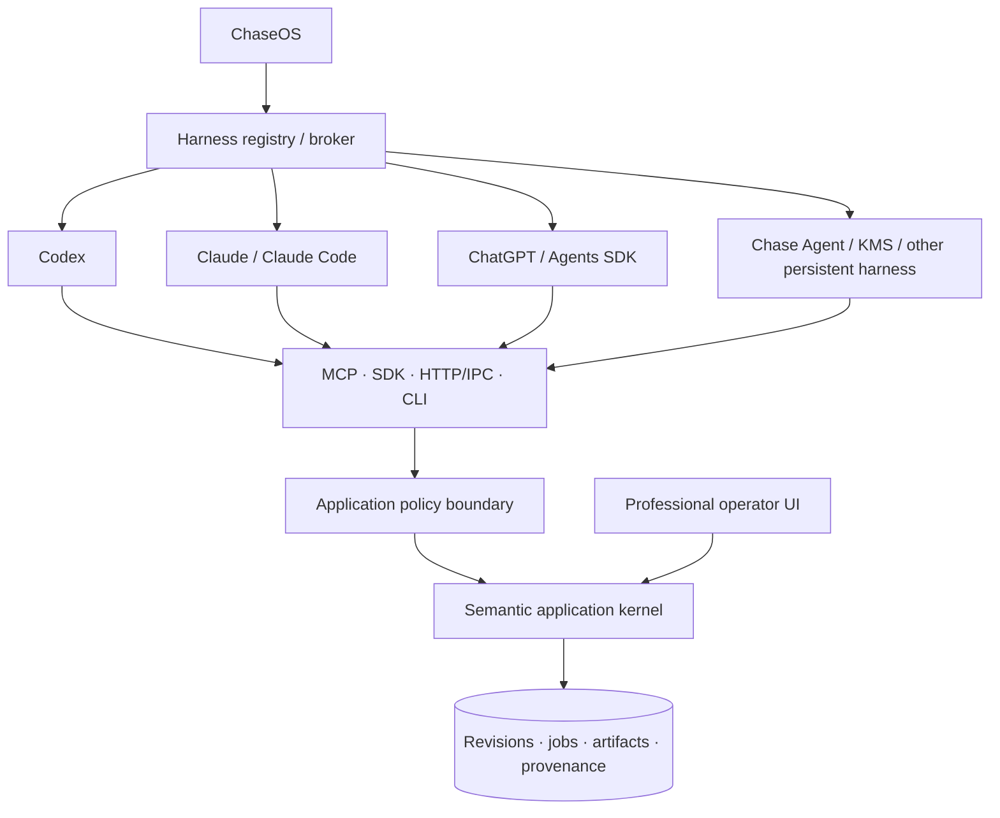

# Harness-Native Software Playbook

**Draft 0.2 — 14 July 2026**  
**Purpose:** a durable engineering and company-building playbook for turning conventional software into agent-first, harness-native products.

This book draft is the narrative layer over the contracts, PRDs, research notes and implementation handovers in this repository. It is deliberately broader than Toolshape Voice and Toolshape Studio. Those products are the first serious application cases, not the limit of the architecture.

Source labels such as `[osworld]` refer to entries in `research/SOURCES.json`. Product examples are clean-room outcome analysis, not instructions to copy proprietary code, assets, private prompts or distinctive interfaces.

---

## 1. The category shift

Traditional software assumes that a human is the primary runtime. The software exposes screens; the human interprets them, remembers context, decides what to do, and translates intent into clicks, keystrokes and edits. Automation is usually secondary: a macro, a partial API, a plug-in surface or browser scripting added after the interface has already become the product architecture.

Agentic software changes the primary runtime. A capable harness can hold a goal, inspect state, choose tools, execute multi-step work, verify results and recover. Yet most applications force that harness to operate through pixels or brittle UI internals. This wastes model capability on button finding and reconstructing hidden state.

The target is not “put a chatbot in the sidebar.” The target is a different application shape:

> A harness-native application is a semantic, stateful and policy-enforced execution environment whose capabilities can be discovered, inspected, simulated, invoked, verified and recovered by an external agent harness without depending on the human GUI.

The human interface remains excellent. Agents remove manual labour; humans retain authorship, judgement and direct manipulation. This is high automation **and** high control, not autonomy purchased by deleting the editor.

### 1.1 Maturity levels

| Level | Description | Practical test |
|---:|---|---|
| 0 | GUI-only | Normal work requires screen interaction. |
| 1 | AI-featured | The application has generation, search or summarisation, but cannot operate its own wider domain. |
| 2 | Automatable | APIs, scripts or CLI commands exist, often shaped around raw CRUD or UI internals. |
| 3 | Agent-compatible | Typed capabilities, machine-readable state, durable jobs and structured errors exist. |
| 4 | Harness-native | External harnesses can preview, authorize, execute, verify and recover multi-step work safely. |
| 5 | Agent-native ecosystem | Capabilities, workflows, identity, provenance and payments compose across applications and harnesses. |

The immediate engineering target is Level 4. Level 5 is earned through dependable contracts, not announced through a marketplace page.

### 1.2 Why pixels are the fallback

OSWorld showed a major gap between human and agent performance in real computer environments and identified GUI grounding and operational knowledge as core difficulties `[osworld]`. OSWorld-MCP later demonstrated that semantic tools can improve computer-use agents while also showing that agents do not always invoke available tools correctly `[osworld-mcp]`. WindowsWorld adds cross-application process complexity `[windowsworld]`.

The lesson is not that visual computer use should disappear. It remains essential for legacy applications and unsupported edge cases. The engineering preference order is:

```text
typed semantic capability
> in-process SDK or domain API
> local IPC / HTTP
> CLI
> accessibility automation
> visual computer use
```

A product you control should not make the least reliable control plane its primary one.

---

## 2. ChaseOS, harnesses and applications

The corrected hierarchy is:



### 2.1 ChaseOS is supervisory

ChaseOS owns cross-application concerns:

- selected personal, organizational and project knowledge;
- reusable workflow recipes and execution evidence;
- approvals, budgets and payment rules;
- scheduling and persistent work;
- harness registration, selection and coordination;
- cross-application provenance and operator policy;
- research intake and proposals to evolve contracts;
- the user’s durable operating context.

ChaseOS does not need to perform every reasoning step itself. It creates the conditions in which a chosen harness can work with the right context, permissions, budget and evidence requirements.

### 2.2 Harnesses are active runtimes

A harness may:

- choose and route models inside its runtime;
- plan and decompose work;
- use tools and the filesystem;
- coordinate workers;
- manage short-term context;
- inspect results;
- retry, escalate or recover;
- return evidence and artifacts.

Different harnesses will reason and navigate differently. The application must therefore expose stable capabilities rather than rely on one model’s prompt conventions.

### 2.3 Applications remain sovereign over their domains

The application owns:

- domain objects and invariants;
- authoritative state;
- capability contracts;
- revisions and transactions;
- object-level authorization;
- long-running jobs;
- deterministic validation;
- domain-specific verification;
- undo, restore or compensation;
- artifact identity and provenance.

Even an approved ChaseOS workflow cannot force an application to accept a stale revision, invalid timeline, unauthorized resource or unsafe operation.

### 2.4 Standalone products matter

Toolshape Voice and Toolshape Studio must remain valuable without ChaseOS. A standalone user receives local policy settings, an audit/job centre, a built-in agent surface or supported external harness, and the same MCP/SDK/CLI/HTTP capability layer. ChaseOS amplifies the products; it does not become a hidden runtime dependency.

---

## 3. The semantic application kernel

A conventional application often hides domain meaning inside components, event handlers, canvas objects, timeline widgets and controller code. That makes the GUI the de facto API. A harness-native application reverses this relationship.

The semantic kernel contains the domain truth. Every interface is an adapter.

### 3.1 The minimum kernel

```text
Domain model      What objects exist and what do they mean?
Queries           What state can be inspected without mutation?
Commands          What semantic changes can be requested?
Invariants        What must always remain true?
Transactions      Which changes succeed or fail together?
Revisions         Which exact state version is being changed?
Jobs              How is long-running work represented?
Artifacts         What immutable outputs were produced?
Verification      How is success proven from resulting state?
Recovery          How is work reversed, restored or compensated?
Provenance        Who/what caused each state transition?
```

Domain-driven design is relevant because the capability vocabulary should reflect the real domain rather than the current toolbar `[book-ddd]`. Designing Data-Intensive Applications supplies the state, consistency, transaction and distributed-systems foundation `[book-ddia]`.

### 3.2 Modular monolith first

Harness-native does not imply microservices. A modular monolith can provide stronger transactions, simpler local-first deployment and faster contract iteration. Split services only when measured scaling, security isolation, fault containment or ownership requires it.

A useful package boundary is:

```text
contracts/
kernel/
policy/
secrets/
jobs/
artifacts/
provenance/
verification/
recovery/
adapters/{sdk,http,cli,mcp}/
ui/
providers/
```

The UI imports application services or generated clients. It does not own hidden business rules.

### 3.3 Canonical objects, not renderer objects

A design project must not persist Fabric.js, browser-canvas or renderer-specific objects as its canonical scene. A video project must not persist a shell command as its timeline. A voice session must not collapse raw audio, transcript, cleaned text and inserted result into one mutable string.

Own stable schemas. Treat renderers, ASR providers, codecs and operating-system APIs as replaceable adapters.

---

## 4. The operation lifecycle

A normal API assumes the caller already knows the exact endpoint, object ID and desired mutation. An agent often begins with a descriptive goal. Harness-native applications need an operational lifecycle that makes uncertainty and authority explicit.

```text
Discover
→ inspect and resolve
→ plan
→ preview
→ authorize
→ execute
→ verify
→ recover
```

### 4.1 Discover

The harness obtains a filtered capability manifest. Discovery considers user identity, project context, installed providers, online/offline state, permissions, feature flags, costs and application version.

A manifest should state:

- capability ID and semantic version;
- input/output schemas;
- side effects and risk;
- dry-run, idempotency and batching support;
- approval requirements;
- latency/cost class;
- verifier and recovery method;
- examples and structured error categories.

### 4.2 Inspect and resolve

The harness receives compact semantic projections instead of raw internal databases or giant project documents. It can search descriptive targets and receive ranked candidates with stable identifiers, distinguishing attributes, evidence and ambiguity.

Useful projections include:

```text
project.summary
project.structure
project.selection
project.changed_since
project.validation_report
project.artifacts
```

### 4.3 Plan

The plan is typed data, not only prose. It states intended capabilities, targets, constraints, dependencies, expected artifacts and required approvals. The plan can be stored, reviewed, reused and evaluated.

### 4.4 Preview

A preview evaluates the plan without committing domain mutation. It returns projected semantic differences, affected objects, warnings, policy conflicts, cost, duration, expected artifacts, irreversible effects and approval boundaries.

Preview is not a vague model explanation. It is produced against the application’s actual current revision.

### 4.5 Authorize

The model may request an action; it cannot grant itself authority. Authorization binds a principal, delegated agent, capability, exact target, parameter limits, cost limit, expiry and invocation count.

### 4.6 Execute

Execution uses runtime schema validation, policy evaluation, optimistic concurrency, idempotency and transactions. Long operations create jobs rather than holding a tool call open indefinitely.

### 4.7 Verify

A successful transport response is not proof of goal completion. Verification re-reads state and checks postconditions. AppWorld’s state-based tests and tau-bench’s repeated-run measures are central references `[appworld] [tau-bench]`.

### 4.8 Recover

Recovery may mean inverse operation, snapshot restoration, compensation, corrected retry, provider fallback, return to user or safe degradation. “Undo” is not always physically possible, so the contract must state the real recovery class.

---

## 5. The operation envelope is not memory

This distinction prevents a common architectural mistake.

### 5.1 Operation envelope

The envelope is the state-transition contract and audit record. It includes:

- schema/version;
- operation and idempotency identifiers;
- trace and actor/delegation chain;
- intent;
- capability and version;
- target and expected revision;
- typed input;
- context and opaque secret references;
- risk and authorization;
- dry-run/atomicity/timeout;
- retention class;
- timestamps.

It answers: **what was requested, by whom, against which state, under which authority, and what happened?**

### 5.2 Memory and personalisation

Memory answers different questions:

- What styles does this operator prefer?
- Which corrections recur?
- Which workflow recipes have succeeded?
- Which examples should be retrieved?
- Which quality trade-offs does this operator accept?

Store these as separate, versioned objects:

```text
StyleProfile
ApprovedExemplar
PreferenceComparison
CorrectionEvent
WorkflowRecipe
AggregateAnalytics
RetrievalEmbedding
```

Embeddings are retrieval indexes, not truth. A vector should point to an attributable source object. Changing a style weight creates a new style-profile revision through an operation; the envelope records the change.

### 5.3 Self-evolving without self-corruption

“Self-evolving” should mean evidence-driven updates to versioned profiles, recipes, rankings and proposed contract changes. It should not mean an unconstrained model rewriting production code, permissions or its own safety policy.

A safe learning loop is:

```text
observe explicit correction or approved outcome
→ extract candidate preference/rule
→ estimate confidence and affected scope
→ test against evaluation set
→ preview profile/recipe change
→ obtain policy or human approval
→ create new version
→ monitor regressions
→ roll back when needed
```

---

## 6. Capability design and the agent-computer interface

Tool design is product design for agents. ReAct, Toolformer and Gorilla established foundational ideas around reasoning/action loops and API use `[react] [toolformer] [gorilla]`. Production guidance from Anthropic emphasizes simple composable patterns and careful tool interfaces `[anthropic-effective-agents]`.

### 6.1 Avoid UI-shaped tools

Bad:

```text
click_toolbar_button
move_mouse
select_layer_17
press_export
```

Good:

```text
studio.timeline.split_clip
studio.scene.apply_operations
studio.style.apply_profile
studio.quality.validate
artifact.export
```

### 6.2 Avoid giant magic tools

A capability called `make_everything_good` cannot be previewed, verified or recovered precisely. Use two layers:

- semantic primitives for deterministic edits;
- goal-level workflows that compose primitives for common outcomes.

The application should expose roughly 12–20 stable high-value agent tools per product at first. That does not limit internal feature count. A single `apply_operations` capability can carry a typed union of many deterministic scene or timeline operations while preserving atomic preview and verification.

### 6.3 Structured errors are part of the interface

Errors should identify whether they are retryable, whether state changed, what field failed, what candidates exist and what recovery is allowed.

Canonical categories include:

```text
ambiguous_target
missing_context
stale_revision
invalid_operation
invariant_violation
permission_denied
approval_required
spending_limit_exceeded
data_egress_blocked
provider_unavailable
rate_limited
partial_failure
verification_failed
```

A generic “400 Bad Request” forces the model to guess.

### 6.4 Adapter parity

SDK, HTTP/IPC, CLI and MCP must all reach the same handler. Parity tests compare final state and artifacts, not response wording. This is how the application stays portable across Codex, Claude Code, ChatGPT/Agents SDK and persistent ChaseOS-managed harnesses.

MCP supplies a standard host/client/server transport for tools, resources and prompts `[mcp-spec]`. It should expose domain capabilities, not become the domain architecture itself. A2A belongs where one autonomous service delegates to another `[a2a-spec]`.

---

## 7. Human-agent experience

The operator is not removed from authorship. The operator is removed from repetitive labour.

### 7.1 One world, two control modes

The human editor and harness operate the same objects. When a user selects a layer, clip, transcript span or text block, that semantic selection is available to the harness. When the harness edits, the UI shows the same revision and semantic diff.

### 7.2 Stable professional editor

Toolshape Studio still needs a high-quality canvas, layer panel, inspector, timeline, waveform, caption lane, keyboard model, preview and history. Toolshape Voice still needs a polished Flow Bar, Hub, Scratchpad, analytics and settings. A weak human interface would make operator review and master touches slower, undermining the whole system.

### 7.3 Dynamic task interfaces

A harness can request a schema-driven temporary interface for a specific task:

- candidate comparison grid;
- style preference tournament;
- caption correction table;
- brand violation review;
- render approval card;
- ambiguous-target chooser;
- before/after semantic diff.

The application renders trusted components from a declarative schema. The agent does not inject arbitrary executable UI code.

### 7.4 Progressive autonomy

Autonomy is configured per risk and capability, not through one global switch.

| Tier | Example | Default |
|---:|---|---|
| 0 | inspect/search/summarize | automatic |
| 1 | preview/validate/estimate | automatic |
| 2 | reversible local mutation | policy-controlled, often automatic |
| 3 | external but reversible action | explicit delegation or contextual approval |
| 4 | public, financial, destructive, legal or privacy-sensitive action | exact human approval immediately before execution |

Users may tighten or relax defaults within allowed limits. Hard invariants—password-field refusal, permission boundaries, spend ceilings, destructive-action constraints—cannot be disabled by a prompt.

### 7.5 Product coaching

Each application should teach the operator while it works:

- explain quality problems and evidence;
- show which style choices produce better outcomes;
- surface recurring dictation corrections;
- recommend workflow shortcuts;
- measure speed, reliability and improvement;
- create meaningful milestones without manipulating the user.

The coach should distinguish facts, preferences and suggestions. It must let the user inspect, correct, export and delete its learned profile.

---

## 8. Security, secrets and deletion

Agentic systems combine untrusted content with real authority. AgentDojo, InjecAgent, AgentDyn and CaMeL show why prompt injection cannot be treated as a string-filter problem `[agentdojo] [injecagent] [agentdyn] [camel]`.

### 8.1 Security laws

1. Model output is a request, not authorization.
2. Imported content is data, never authority.
3. Data cannot expand capabilities or network access.
4. Secrets are opaque handles, not prompt content.
5. The executor—not the model—holds credentials.
6. Every egress path is policy-controlled.
7. High-impact actions use exact transaction-bound approval.
8. Logs, traces and analytics are redacted by construction.
9. Workers are isolated by capability and data scope.
10. Recovery and evidence are security features.

### 8.2 Secret lifecycle

The user’s intuition—identify secrets, protect them and remove them after the job—is directionally right. The safe implementation is more precise:

```text
classify or explicitly register secret
→ store encrypted secret in broker/vault
→ return opaque secret:// handle
→ issue short-lived scoped lease to isolated worker
→ resolve only at the trusted provider boundary
→ prohibit prompt/log/artifact persistence
→ revoke lease
→ destroy per-job data-encryption key where used
→ delete eligible temporary copies
→ emit deletion/retention report
```

Use short-lived dynamic credentials where possible `[owasp-secrets] [vault-secrets-engines]`. Workload identity can use SPIFFE-like principles `[spiffe-overview]`.

### 8.3 Honest deletion semantics

“Deleted permanently everywhere” cannot be promised once plaintext has been sent to a third party, captured in inaccessible backups, written by an operating system, or retained under another controller’s policy. The system should return explicit deletion coverage:

```text
local_worker_memory: best-effort zeroized
local_temp_storage: deleted
per_job_key: destroyed
application_logs: never stored plaintext
provider_copy: governed by provider contract
backup_copy: expires under stated schedule
```

Crypto-erasure is useful when data is encrypted under a dedicated key and all recoverable key copies are destroyed. It is not retroactive magic. NIST media sanitization and key-management guidance should inform claims `[nist-media-sanitization] [nist-key-management]`.

### 8.4 Sanitisation is not emoji corruption

Replacing a secret with a distinctive marker can help preserve workflow shape, but the marker must be a typed token such as `secret://handle/<id>` with no reversible value. Unicode corruption, emojis or visual masking are not security controls. They can leak through logs, normalization, copy/paste or model reconstruction.

---

## 9. Evaluation and conformance

The test target is the resulting environment, not the eloquence of the agent’s final message.

### 9.1 Core measures

| Dimension | Test |
|---|---|
| Goal success | Does the requested final state exist? |
| Collateral damage | Did unrelated state change? |
| Contract correctness | Were valid capabilities and parameters used? |
| Policy compliance | Were forbidden actions attempted or executed? |
| Approval correctness | Did execution pause at the exact boundary? |
| Verification quality | Did the system correctly judge success/failure? |
| Recovery | Could it restore or compensate after faults? |
| Consistency | What is pass^k across repeated runs? |
| Efficiency | Calls, tokens, latency, compute and cost per verified outcome |
| Human burden | How many unnecessary approvals/corrections occurred? |
| Privacy | Did content or secrets cross prohibited boundaries? |
| Version resilience | Do workflows survive schema/application upgrades? |

### 9.2 Benchmark-derived focus

- **OSWorld family:** GUI grounding, operational knowledge and computer-use fallback.
- **OSWorld-MCP:** whether agents discover and prefer semantic tools.
- **WindowsWorld:** cross-application process workflows.
- **AppWorld:** state-based assertions and collateral-damage checks.
- **tau-bench:** multi-turn tool-agent-user interaction and repeated-run reliability.
- **AgentDojo/InjecAgent/AgentDyn:** untrusted content and prompt-injection resistance.

### 9.3 Product-specific evidence

Voice evaluation needs a Windows target matrix, protected-token corpus, language/accent coverage, latency distribution, insertion verification and network-egress tests.

Studio evaluation needs scene/timeline invariant tests, render probes, editability checks, style preference agreement, visual quality dimensions, caption/audio correctness, stale-revision tests and operator-interruption cases.

### 9.4 Trace every episode

Preserve:

```text
goal
capability manifest
state inspected
plan
approvals
operations
results
semantic diffs
verification evidence
recovery
final state
artifacts
cost and latency
```

Use OpenTelemetry-compatible agent semantics where practical `[otel-genai-agent]`, but keep domain provenance richer than generic spans.

---

## 10. Product application: system-wide Voice

The primary job is not file transcription. It is system-wide dictation into supported Windows text fields.

### 10.1 Golden loop

```text
focus a supported text target
→ hold configurable global hotkey
→ capture and display listening state
→ stream/local-transcribe
→ preserve raw transcript
→ protect identifiers, URLs, code, names and numbers
→ apply dictionary/snippets/profile cleanup
→ show or apply final text under policy
→ insert into the still-valid target
→ verify where possible
→ preserve recoverable history and analytics under retention settings
```

Public Wispr Flow material establishes an outcome baseline around text-field dictation, languages, cleanup, dictionary/snippets/styles, developer context, analytics and ongoing reliability work `[wispr-features] [wispr-whats-new]`. The implementation remains clean-room and original.

### 10.2 Windows insertion tiers

No single API honestly covers every Windows application.

1. **Text Services Framework path** for deeper text-service integration where justified `[win-tsf]`.
2. **UI Automation/value-pattern path** for inspectable editable controls.
3. **Unicode SendInput path** for broad normal-integrity targets `[win-sendinput] [win-keybdinput]`.
4. **Clipboard-assisted fallback** with explicit status and no false claim of verified insertion.
5. **Unsupported/blocked** for password fields, integrity/UIPI conflicts, secure desktops and targets that cannot be safely verified.

Global hotkeys use the Windows registration lifecycle and report conflicts clearly `[win-registerhotkey]`.

### 10.3 Personal language model

The product learns through explicit corrections, dictionary additions, snippet use, accepted rewrites and application context. It stores versioned rules and evidence—not hidden raw content forever.

Analytics can include words dictated, time saved, correction rate, latency, language/app mix, streaks and protected-token accuracy. Milestones such as 5K, 10K, 25K and 50K words can unlock profile summaries and titles, provided the analysis is transparent, local-first where promised, optional and deletable.

### 10.4 Architecture as education

The implementation intentionally exposes Year 2 computer-science concepts:

- finite-state machines for session/hotkey/job lifecycles;
- interfaces/traits and dependency inversion for ASR/insertion providers;
- sets and logic for scopes, policies and capability algebra;
- graphs for workflows and provenance;
- vectors/matrices for audio features and future embeddings;
- probability/statistics for confidence, latency and error analysis;
- property and integration testing for invariants.

Each implementation issue should link the practical code to the relevant concept.

---

## 11. Product application: unified Studio

The Studio is one content system, not a Canva clone glued to a CapCut clone. A shared project contains assets, scenes, timelines, style profiles, artifacts, history and provenance. Design and video use the same operator identity and agent surface.

Public Canva material supports the value of a connected visual suite and editable structured AI output `[canva-visual-suite] [canva-magic-layers]`. Public CapCut material supplies an outcome baseline for timeline editing, effects, captions, audio, keyframes and export `[capcut-online-editor] [capcut-auto-captions] [capcut-keyframes]`.

### 11.1 Canonical project model

```text
Project
  Assets
  Scenes / artboards
    Text, image, vector, shape, group, component, effect
  Timeline
    Video, audio, caption, overlay and effect tracks
  Style profiles and brand constraints
  Workflow recipes
  Revisions and operation history
  Render/export presets
  Artifacts and provenance
```

Time uses rational values or explicit frame/timebase pairs. Media originals are immutable. Render jobs compile canonical state into a safe argument array or worker plan; raw shell commands are never the project format.

### 11.2 First 21 feature families

1. projects, assets and media ingest;
2. scene/artboard system;
3. text engine;
4. image/vector/shape layers;
5. transforms, alignment and grouping;
6. constraints and responsive variants;
7. templates/components/data binding;
8. style profiles and brand systems;
9. timeline/tracks/clips;
10. split, trim, slip, move and ripple;
11. keyframes, easing and animation presets;
12. transitions;
13. visual effects including blur and masks;
14. colour and adjustment stack;
15. audio gain, mute, fades, ducking and normalization;
16. waveform and voice cleanup hooks;
17. transcript-based editing;
18. captions/subtitles;
19. smart selection/background/reframe hooks;
20. deterministic preview/render/export;
21. history, semantic diff, quality validation and agent orchestration.

The 80/20 rule applies inside each family. The first vertical slice proves one high-value path end to end; it does not pretend each family is complete.

### 11.3 Style intelligence without generic AI output

Professional style cannot be reduced to one universal aesthetic score. Research such as DesignPref, DesignSense, TASTE and ViPer supports multi-dimensional and personal preference modelling `[designpref] [designsense] [taste] [viper-personalization]`.

The Style Genome should represent dimensions such as density, contrast, typography, colour, geometry, motion, pacing, imagery, caption behaviour, sound and brand constraints. It learns from pairwise choices, explicit settings and approved exemplars. It generates multiple candidates, validates hard constraints, ranks them using user-specific evidence and preserves editability.

CreatiPoster reinforces the value of structured multi-layer outputs rather than flattened generation `[creatiposter]`.

### 11.4 Human-made quality standard

The system should not rely on a prompt asking a model to “make it professional.” Quality comes from:

- structured layout constraints;
- typography and safe-area checks;
- style-profile evidence;
- multiple candidate generation;
- deterministic validators;
- personal preference ranking;
- operator comparison and correction;
- domain-specific render verification;
- regression fixtures.

The operator can interrupt, edit directly and resume the harness from the new revision.

---

## 12. Economics, x402 and licensing

### 12.1 Charge at expensive boundaries

The local path should be genuinely useful. Monetize scarce or operationally costly value:

- premium remote inference;
- GPU render/generation;
- encrypted sync and collaboration;
- licensed assets, fonts, music and stock;
- organization policy/governance;
- high-volume API reliability;
- managed workflows and support.

x402 belongs at remote metered HTTP resource boundaries, not inside every local edit `[x402-docs]`.

```text
quote
→ budget policy
→ approval when required
→ payment authorization
→ idempotent job creation
→ execution
→ verification
→ receipt
→ refund/credit on declared failure
```

### 12.2 Open-source grants are not retractable

A released version under Apache-2.0, MPL-2.0 or AGPL cannot simply be made closed retroactively for recipients who already obtained it under that licence. Future versions can change licence subject to ownership and contributor agreements, but trust and ecosystem consequences remain.

The recommended staged strategy is:

1. build Phase 0 privately while contracts change quickly;
2. publish interoperability schemas, SDKs, adapters and conformance tooling under Apache-2.0 when stable;
3. evaluate MPL-2.0 for local clients/engines where file-level reciprocity fits;
4. keep hosted control-plane operations proprietary/open-core initially;
5. publish a clear future-source policy only when the commitment is real.

Licensing is a product and legal decision; obtain counsel.

---

## 13. The agent-first company operating model

A feature is not finished when the button works. It is finished when it has:

- a human interaction;
- a semantic capability contract;
- policy and risk classification;
- preview semantics;
- verifier;
- recovery method;
- evaluation cases;
- telemetry/provenance;
- version/migration plan;
- documentation for operators and harnesses.

This creates four explicit responsibilities:

```text
Domain/kernel engineering
Human experience
Agent experience/platform
Safety/evaluation
```

A small team may combine them, but none can be omitted.

### 13.1 Parallel agent orchestration

Multiple harnesses can build aggressively when work is bounded by contracts:

- one owner per schema during an integration window;
- generated fixtures and conformance tests as merge gates;
- worktree ownership by domain;
- no weakening tests to make an integration green;
- contract-change proposals with migration and impact notes;
- state-based integration checks after every merge.

The answer to parallel development risk is not artificial serialisation. It is precise interfaces, bounded ownership, reproducible tests and disciplined integration.

### 13.2 Metrics

Add agent-native metrics to normal product metrics:

- verified task completion;
- pass^k consistency;
- unintended mutation rate;
- recovery success;
- approval burden;
- cost per verified outcome;
- human correction rate;
- capability reuse;
- workflow portability;
- model/harness portability;
- profile-learning benefit;
- privacy and egress violations.

The moat becomes a superior semantic model, dependable capabilities, domain verifiers, personal style intelligence, evaluation data, safe delegation and trusted workflows—not merely a copied toolbar.

---

## 14. Research and continuous improvement

The architecture should evolve through evidence, not trend chasing.

### 14.1 Research intake

ChaseOS or a scheduled research harness can:

1. monitor official specifications, product release notes and arXiv/peer-reviewed research;
2. record source date, version and primary URL;
3. extract facts separately from inference;
4. map findings to existing decisions, threats and evals;
5. create a proposal rather than editing contracts directly;
6. run affected conformance cases;
7. request human review for material changes;
8. archive accepted and rejected reasoning.

### 14.2 Reading protocol

For each source capture:

```text
three direct facts
three implications
one disagreement or uncertainty
one architecture change considered
one experiment/evaluation
one exact source location
```

Link notes to a decision, issue, test or rejected alternative. Passive reading does not improve the system.

### 14.3 Evidence hierarchy

Prefer:

1. official specifications and primary documentation;
2. original papers and benchmark repositories;
3. books by recognized domain experts;
4. independent replication and high-quality engineering reports;
5. secondary summaries only for discovery.

Date every current product and protocol claim. Mark preprints and unreplicated claims as provisional.

---

## 15. The constitution

1. The application is its semantic kernel, not its screen.
2. The GUI is never the only control plane.
3. Human UI quality remains first-class.
4. Durable semantic operations are headlessly invocable.
5. Natural language proposes; typed operations mutate.
6. The model never authorizes itself.
7. Imported content is data, never authority.
8. Every meaningful write is revision-aware and idempotent.
9. High-impact work supports exact preview and approval.
10. Long-running work becomes a durable job.
11. Success is verified from state and artifacts.
12. Recovery is designed before autonomy expands.
13. Secrets are opaque handles with explicit retention semantics.
14. Operation history is separate from style and workflow memory.
15. Applications enforce domain invariants independently of ChaseOS.
16. ChaseOS supervises knowledge, policy, approvals, schedules, budgets and cross-app workflows.
17. Harnesses remain replaceable active runtimes.
18. Capabilities remain portable across transports and models.
19. Computer use is a compatibility fallback.
20. Every capability ships with tests, traces and a version strategy.
21. Self-evolution means governed versioned learning, not uncontrolled self-modification.
22. Parallel agent development is enabled by contracts and conformance gates.
23. Local functionality is useful without mandatory cloud dependence.
24. Paid boundaries are explicit, quoted, authorized and receipted.
25. Architecture changes follow evidence and regression tests.

---

## 16. Implementation entry point

Do not begin by cloning competitor screens. Begin with the neutral reference kernel and ANAC conformance suite.

```text
Phase 0
  contracts + neutral workboard kernel + policy + secret broker + adapters + conformance

Phase 1
  Toolshape Voice Windows golden loop

Phase 2
  Toolshape Studio unified editable design/video vertical slice

Phase 3
  hosted sync, collaboration, paid compute, x402 and organization features
```

Use the Codex prompts in `prompts/`, the product handovers in `products/*/CODEX-HANDOVER.md`, and the validation script in `scripts/verify_handover.py`.

The purpose of Phase 0 is not to slow down product work. It gives every parallel agent a stable way to build operations, jobs, revisions, policies, artifacts and evidence once—then reuse them across both products and future agent-first companies.
