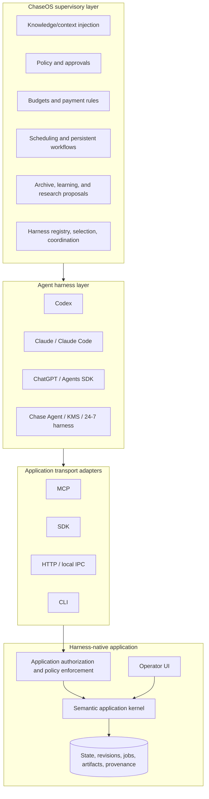

# ChaseOS, harnesses, and application boundaries

## Canonical terminology

This pack uses **ChaseOS** as the canonical name. `ChaserOS` and `TracerOS` are treated as speech-to-text variants unless the owning repository declares otherwise.

## Correct hierarchy



## ChaseOS responsibilities

ChaseOS provides cross-application, user-level supervision:

- injects selected personal, project, and organizational knowledge;
- stores reusable workflow recipes and successful execution evidence;
- coordinates approvals, budgets, schedules, and background work;
- selects or configures an appropriate harness for a task;
- keeps cross-application task state and provenance;
- maintains the operator’s global risk preferences;
- gathers research updates into a proposal queue;
- provides organization-wide controls without changing an application’s domain truth.

## Harness responsibilities

The harness is the active execution environment. Depending on the harness, it may:

- select and route models;
- plan and decompose tasks;
- invoke MCP tools, SDKs, APIs, CLIs, and filesystem operations;
- manage runtime context and short-term memory;
- coordinate worker agents;
- inspect tool results and recover from errors;
- produce code or other application operations;
- return evidence to ChaseOS and the application.

ChaseOS can constrain, schedule, and coordinate the harness. It does not replace the harness’s reasoning and execution loop.

## Application responsibilities

Every application remains the authority for its own domain:

- canonical domain objects and invariants;
- capability definitions and schema versions;
- object-level permissions;
- revision and concurrency control;
- transaction semantics;
- job lifecycle;
- deterministic validation;
- domain-specific verification;
- undo, restore, or compensation;
- artifact identity and provenance;
- local privacy controls and audit logs.

Even when ChaseOS approves an action, the application must independently reject invalid, stale, unauthorized, or unsafe operations.

## Standalone operation

A user without ChaseOS receives the same application kernel through:

- a built-in agent panel or supported external harness;
- application-local approval settings;
- local policy profiles;
- an audit and job centre;
- MCP/SDK/CLI/HTTP access.

This prevents ChaseOS lock-in and makes Toolshape products useful as independent companies.

## Portability method

ChaseOS stores workflow recipes against abstract capability IDs and constraints, not one harness’s prompt syntax.

Example:

```yaml
workflow: create_vertical_campaign
requires:
  - studio.project.inspect
  - studio.design.create_variants
  - studio.video.edit_from_transcript
  - studio.quality.validate
  - artifact.export
constraints:
  aspect_ratio: 9:16
  approval_before:
    - publish.external
```

A harness adapter translates this recipe into the harness’s runtime instructions while ANAC keeps the application capability surface stable.
