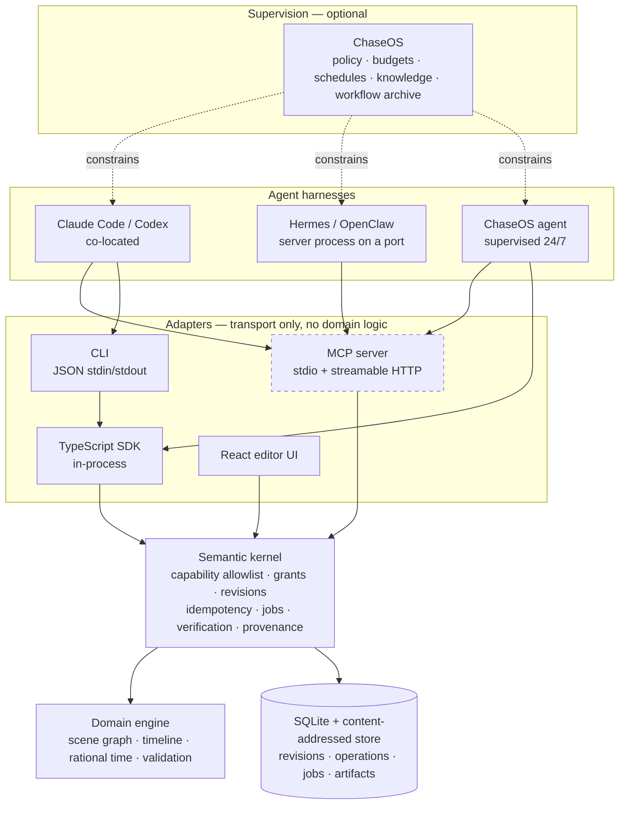
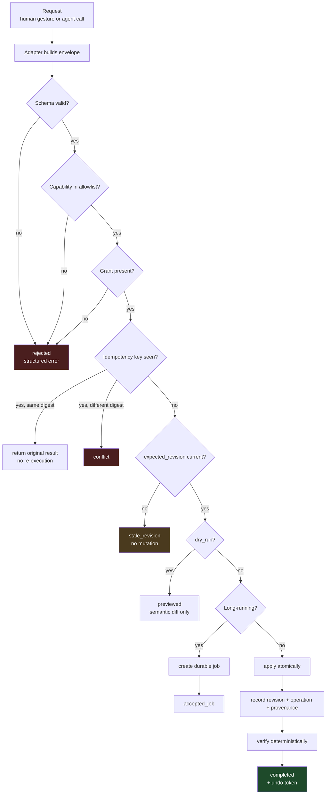
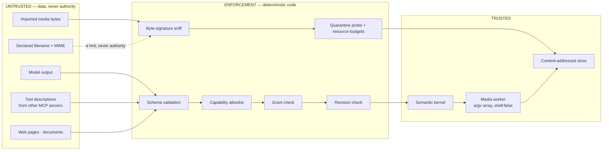
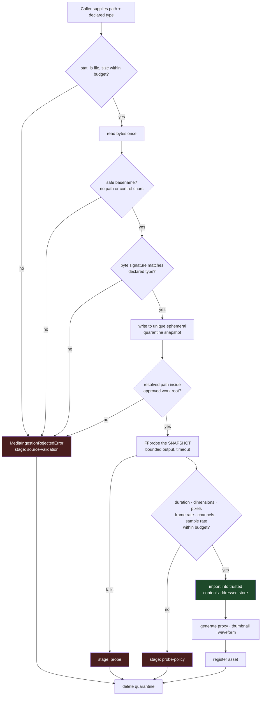
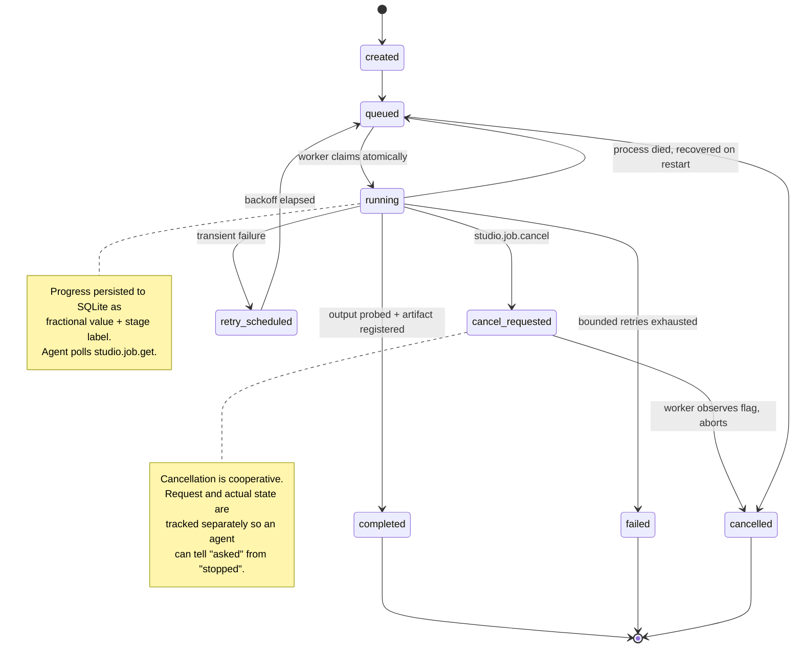
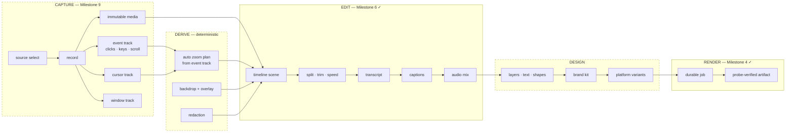
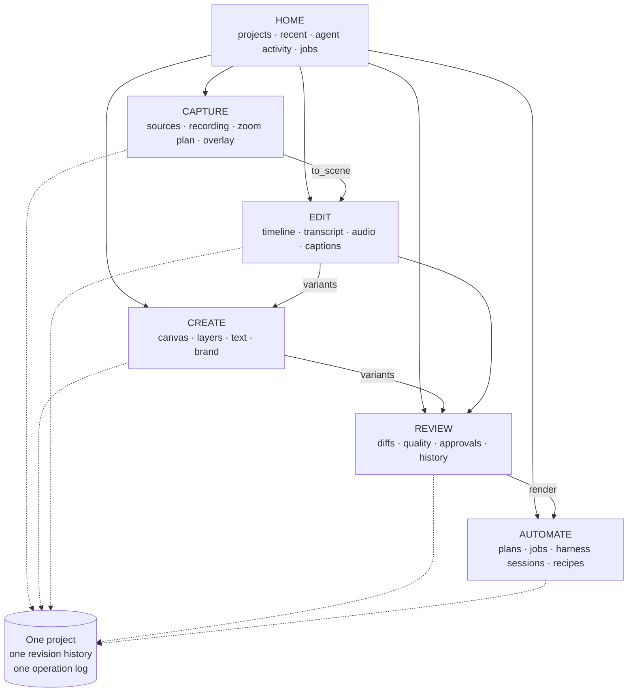
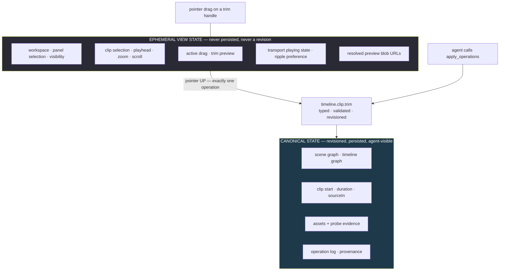
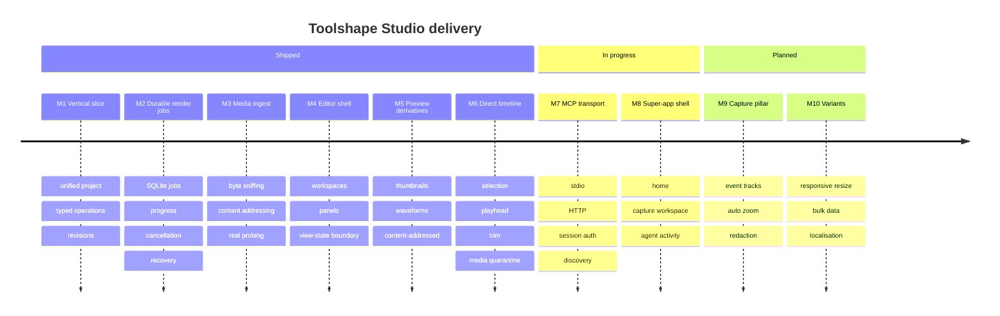

# Toolshape Studio — architecture diagrams

**Date:** 2026-08-05
**Status:** ACTIVE

Canonical diagram set. Every diagram is Mermaid so it renders on GitHub and stays diffable. Diagrams marked **(planned)** describe milestones not yet implemented; everything else reflects code in this repository.

---

## 1. System topology — who talks to what



**Read this diagram for one thing:** every arrow into the kernel carries the same operation envelope. The human UI has no privileged path, and no adapter can reach the store without passing the kernel's checks.

---

## 2. The agent control loop

```mermaid
sequenceDiagram
    participant H as Agent harness
    participant M as MCP adapter
    participant K as Semantic kernel
    participant S as SQLite store

    H->>M: tools/list
    M-->>H: 8 capabilities + JSON Schemas

    H->>M: studio.project.inspect
    M->>K: envelope (read_only)
    K->>S: read snapshot
    S-->>K: project @ revision 7
    K-->>M: project + revision
    M-->>H: state

    Note over H: plan the edit

    H->>M: apply_operations (dry_run: true, expected_revision: 7)
    M->>K: envelope
    K-->>M: semantic diff, no mutation
    M-->>H: preview

    Note over H: diff looks right

    H->>M: apply_operations (dry_run: false, expected_revision: 7)
    M->>K: envelope + idempotency key
    K->>S: atomic commit
    S-->>K: revision 8
    K-->>M: result + undo token
    M-->>H: completed @ revision 8

    Note over H,S: A human edit landing here would make revision 7 stale.<br/>The kernel rejects; the agent must re-inspect and re-plan.<br/>It may never resolve a conflict by overwriting.
```

---

## 3. Operation envelope lifecycle



---

## 4. Trust boundaries



**The axiom:** data can influence a proposal but cannot grant authority. A model's text, a document, and another server's tool description all enter through the same validation funnel. There is no instruction anywhere in this system that a model is trusted to obey for safety purposes.

---

## 5. Media ingestion — the quarantine boundary

Implemented in Milestone 6 (`packages/studio-media/src/ingestion.ts`).



**Why probe the snapshot and not the caller's path:** the caller's path is mutable. Probing it and then importing from it is a time-of-check/time-of-use race — an attacker swaps the file between the two reads. The snapshot is immutable for the lifetime of the check. Rejected bytes never reach the trusted store, and quarantine is deleted on **every** outcome including failure.

---

## 6. Durable job lifecycle

Implemented in Milestone 4 (`packages/studio-render/src/durable-jobs.ts`).



---

## 7. Capture → edit → design → export pipeline (planned)



**The key structural claim:** the event track flows into the zoom plan as *data*. An agent asking to "emphasise every click in the settings panel" is resolved deterministically against recorded events. Against a flat video the same request would need frame-by-frame vision inference and would be unverifiable.

---

## 8. Super-app information architecture



Workspaces rearrange **the same objects**. Switching workspace is ephemeral view state — it never advances the project revision (ADR 0009, ADR 0011).

---

## 9. View state vs. canonical state

The boundary that keeps human and agent editing equivalent.



**Why this matters for agent parity:** a drag produces *one* operation at pointer-up, not one per mouse-move. That operation is the identical, identically-validated operation an agent submits. If UI-only state leaked into revisions, the human path and the agent path would diverge — and UI-side clamping could enforce limits an agent-driven client could bypass. Source-range validation lives in the kernel precisely because UI clamping is usability, not a security boundary.

---

## 10. Milestone status


