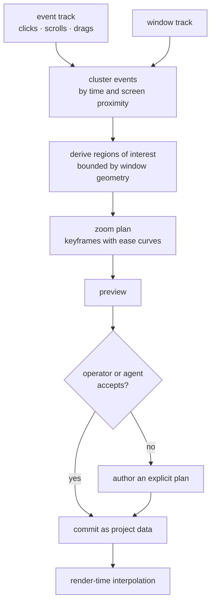

# Capture pillar specification

**Date:** 2026-08-05
**Status:** PARTIAL — the capture document lives on the project at schema v4, and deterministic zoom derivation, the camera path (framing, aspect reframing, cursor smoothing), authored zoom plans and redaction editing are implemented and tested. The capture worker, OS APIs and backdrop rendering remain unbuilt.
**Parent:** `products/studio/PRD-V2.md` §3

---

## 1. Why Studio owns capture

Three reasons, in order of weight.

**The pipeline starts here.** The dominant agent content workflow is capture → cut → caption → brand → export variants. If capture is external, the agent's first step is always "wait for a human to hand me a file", and end-to-end automation is impossible by construction.

**Flat video destroys semantics.** An external recorder hands over pixels. By the time an agent sees the file, the cursor path, click events, window boundaries, active application, keystrokes and scroll events have been baked into a raster and thrown away. Everything that would make intelligent auto-editing possible — and *verifiable* — is gone.

**It closes the agent-native loop.** An agent that can capture can produce content with no human in the loop: drive a demo, record it, edit it, export it. That is the flagship capability of this product, and it is unreachable if recording is someone else's job.

The category gap we exploit: every tool in this space is GUI-only. The open-source reference implementation ships **no CLI, no config file and no API** — an agent's only option there is computer-use. Studio's capture pillar is agent-addressable from its first commit.

---

## 2. The capture document

A capture is **not** a video file. It is a semantic document that renders to video.

```text
CaptureDocument
├── source            display / window / region / camera / audio devices
├── media             immutable content-addressed raw video + audio tracks
├── cursor track      timestamped position, velocity, visibility
├── event track       clicks, key events (redactable), scrolls, drags
├── window track      focus changes, app identity, window bounds
├── zoom plan         derived or authored zoom/pan keyframes over time
├── camera overlay    position, shape, size, follow behaviour
├── backdrop          padding, radius, shadow, background fill
└── transcript ref    link to the transcript/caption document
```

The raw recorded bytes are immutable and content-addressed like every other asset (ADR 0002). **Everything else is a re-editable derived layer.** Changing the zoom plan after recording is a semantic operation producing a new revision — it does not re-record, and it does not re-encode until render.

### 2.1 Why this makes capture agent-operable

This is the decision the whole pillar rests on.

Consider the request *"emphasise every click in the settings panel."*

| Against a flat video | Against a capture document |
|---|---|
| Run vision inference over frames to guess where clicks happened | Read the event track |
| Guess which window was the settings panel | Read the window track |
| Non-deterministic — different results per run | Deterministic — same input, same output |
| Unverifiable — no ground truth to check against | Verifiable — assert one zoom span per click event |
| Expensive | Effectively free |

The event track is the ground truth. Keeping it as data rather than pixels is what turns an unverifiable vision problem into a deterministic query.

---

## 3. Capabilities

| Capability | Purpose | Risk |
|---|---|---|
| `studio.capture.list_sources` | Enumerate displays, windows, cameras, audio devices | read_only |
| `studio.capture.start` | Begin a recording session against a declared source | reversible_local_write |
| `studio.capture.stop` | End session, finalize immutable media, register the document | reversible_local_write |
| `studio.capture.get_session` | Poll an in-flight recording's state and duration | read_only |
| `studio.capture.plan_zoom` | Derive or set zoom/pan keyframes from the event track | reversible_local_write |
| `studio.capture.set_overlay` | Configure camera bubble, backdrop, cursor styling | reversible_local_write |
| `studio.capture.redact` | Mask regions, drop keystroke spans, blur windows | reversible_local_write |
| `studio.capture.to_scene` | Project a capture document into an editable timeline scene | reversible_local_write |

---

## 4. Requirements

| ID | Requirement |
|---|---|
| CAP-1 | Recording is consent-gated at the OS level and never starts without an explicit, attributable authorization. An agent cannot silently begin recording. |
| CAP-2 | A visible, non-suppressible recording indicator is present for the entire session, regardless of who initiated it. |
| CAP-3 | Keystroke capture defaults to **off**. When enabled it excludes fields the OS marks as secure, and captured text is redactable before any render. |
| CAP-4 | Cursor, event, window, zoom and overlay tracks are semantic project data — never baked into the stored original. |
| CAP-5 | Auto-zoom is derived deterministically from the event track, is fully previewable, and is always overridable by an authored plan. |
| CAP-6 | Capture never writes to the trusted content store until the session finalizes and passes the same probe/budget gate as any other media import (ADR 0011). |
| CAP-7 | A capture document projects losslessly into a timeline scene; editing the scene never invalidates the capture's event tracks. |
| CAP-8 | Semantic event data degrades last under load. Dropping a frame is acceptable; losing the click that explains the frame is not. |

### 4.1 CAP-1 to CAP-3 are hard invariants

Screen recording driven by an autonomous agent is a serious privacy surface. **No configuration flag, policy profile, agent grant, or approval may disable the consent gate, suppress the recording indicator, or silently enable keystroke capture.**

This is the same class of invariant as "never bypass object authorization" in `docs/11-security-secrets-privacy.md` — a rule that survives every configuration, because the configuration surface is exactly what an attacker or a confused agent would try to move.

A useful test of any proposed capture feature: *if a compromised or misaligned agent had full grants, what could it record without the user knowing?* The answer must remain "nothing."

---

## 5. Auto-zoom derivation

Deterministic, previewable, overridable.



Implemented constraints:

- **Overlapping regions are refused, not blended.** A frame cannot be zoomed to
  two places at once, so clusters active over the same moments are ambiguous.
  The denser region wins and the other is left unzoomed — deterministic, and
  visually calmer than inventing a framing that covers both.
- **Leads are fitted to the gap.** A region's zoom-out never runs into the next
  zoom-in; the available gap is shared between them.
- **Bounded zoom rate.** A zoom plan that changes faster than a legibility threshold is rejected at validation, not merely discouraged — rapid zoom oscillation is the characteristic failure of naive auto-zoom.
- **Window-aware.** Zoom regions clamp to window bounds from the window track, so a zoom never frames half a window and half the desktop.
- **Idle suppression.** Long stretches with no events produce no zoom, rather than drifting.
- **Always overridable.** A derived plan is a *proposal*. An authored plan replaces it entirely and is never silently re-derived.

---

## 6. Redaction

Redaction is a first-class operation, not a post-hoc filter, because agent-driven recording makes accidental capture of sensitive content much more likely than human-driven recording does.

| Kind | What it removes |
|---|---|
| Region mask | A fixed screen rectangle across a time span |
| Window mask | Everything belonging to a window identity, tracked as it moves |
| Keystroke span | Recorded key events across a time range |
| Application blackout | All frames while a named application held focus |

Redaction applies to **derived output**. The immutable original is unchanged — which is deliberate and has a consequence worth stating plainly: *redaction hides content from renders; it does not erase it from the stored original.* Anything stronger requires deleting the original, and the product must not imply a guarantee it cannot make (`docs/11-security-secrets-privacy.md`, deletion and crypto-erasure).

---

## 7. Ingestion boundary

Captured bytes are **untrusted** and pass the same gate as any external import (ADR 0011), for a non-obvious reason: the capture worker is a subprocess handling encoder output, and a compromised or malfunctioning encoder is exactly the sort of thing the quarantine boundary exists to contain.

```text
finalize session
  → write to ephemeral quarantine snapshot
  → probe the snapshot (bounded output, timeout)
  → enforce duration / dimension / pixel / frame-rate / audio budgets
  → import into the content-addressed store
  → generate derivatives
  → delete quarantine on every outcome, including failure
```

---

## 8. Implementation order

1. Pure derivation module: event clustering, zoom-plan generation, timecode mapping — testable with synthetic event tracks and no OS capture at all.
2. Capture document schema, migration, and validation rules.
3. `to_scene` projection with round-trip tests.
4. Platform capture worker behind a narrow interface, with the consent gate and indicator implemented first and tested as invariants.
5. Redaction operations.
6. Render-time compositing: zoom interpolation, cursor smoothing, backdrop, overlay.
7. MCP capability exposure — no protocol change required.

Steps 1–3 carry most of the product risk and need no platform APIs, so they come first. Step 4 is where platform divergence lives and is deliberately isolated behind an interface.

---

## 9. Non-goals

- Copying any competitor's layout, wording, icons, cursor assets, or wallpapers.
- Real-time streaming or broadcast output.
- Multi-machine or remote capture.
- Editing the immutable original in place.
- OS-level sandboxing of the capture worker (tracked separately as a security milestone).
- Automatic upload or publishing of recordings — there is no egress path, by design.
