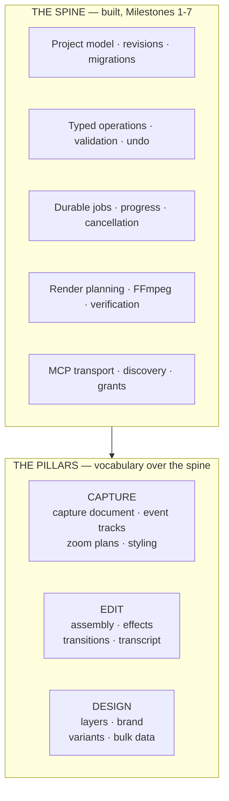
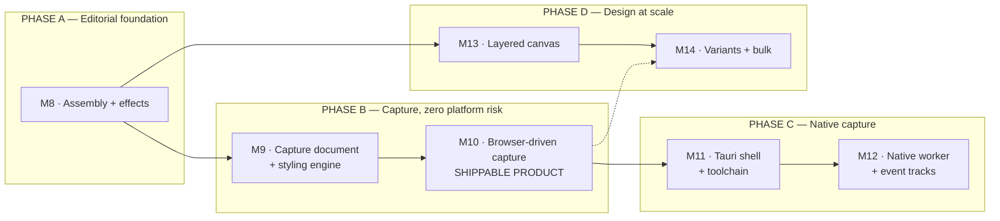

# Toolshape Studio roadmap

**Date:** 2026-08-05
**Status:** ACTIVE
**Parent:** `products/studio/PRD-V2.md`

Three pillars, one spine. This document maps what gets built, in what order, and — more importantly — **why that order**, since the obvious order is wrong.

---

## What we are building

> **Studio-quality content, produced by agents, finished by you.**

**Toolshape Studio is a super-app for content creators and marketers who work in screen capture** — product demos, feature announcements, tutorials, onboarding walkthroughs, launch videos, and every platform variant of those.

The work that defines this audience is repetitive precision work at relentless volume: record the demo, cut the dead air, zoom on the click, caption it, brand it, export four platforms at three aspect ratios, repeat next week. Every step is rule-governed and verifiable — the exact shape of work an agent should do, and the exact work today's tools force a person to do by hand, because they are built for a mouse.

**Agent-native first.** Not "a creative tool with AI features bolted on." The semantic operation surface *is* the product and the interface is one way to reach it. A human dragging a trim handle and an agent making a call submit the identical operation, through identical validation, into identical history. Everything in this roadmap is a new *operation* before it is a new *panel*, and that ordering is the point.

Canonical product language, including what we deliberately do not claim, is in [POSITIONING.md](POSITIONING.md).

---

## The organising principle

Every pillar adds *vocabulary* to a spine that already exists:



**Consequence:** a new capability is a new operation type plus a UI affordance. It is instantly reachable by every agent over MCP with zero transport work — `tools/list` advertises the schema, `apply_operations` carries it, and adapter parity is already proven. This is the compounding return on Milestone 7, and it is why the roadmap looks like vocabulary expansion rather than app-building.

---

## Answering the hard question first: is agent-native screen capture actually possible?

**Yes.** The confusion is about where consent sits.

```mermaid
sequenceDiagram
    participant Human
    participant OS
    participant Worker as Studio capture worker<br/>(trusted, holds permission)
    participant Agent as Agent harness

    Human->>OS: grant screen recording to Studio (once)
    OS-->>Worker: permission held

    Note over Agent,Worker: From here the agent commands; it never records.

    Agent->>Worker: studio.capture.start(source)
    Worker->>OS: begin capture · show indicator
    Worker-->>Agent: session_id
    Agent->>Worker: studio.capture.get_session
    Worker-->>Agent: recording · 00:14
    Agent->>Worker: studio.capture.stop
    Worker-->>Agent: capture document + event track
    Agent->>Worker: studio.capture.plan_zoom(from events)
    Worker-->>Agent: semantic diff — previewable
```

The agent has no more capability than the human granted the application. It cannot record something the human did not authorise the app to record, and it cannot suppress the indicator. This is the same shape as durable render jobs, which already work exactly this way.

**The styling is where our model beats the category.** In existing tools, auto-zoom is an algorithm's guess that a human corrects by dragging on a timeline. Here the zoom plan is *data* — keyframed regions over time — so an agent reads click events, computes a plan, previews the diff, commits, and verifies. Deterministic, reviewable, undoable.

We already have the substrate: `interpolateKeyframes` with easing exists in `packages/studio-engine/src/animation.ts`. A zoom plan is keyframes on a camera transform. Backdrop, padding, corner radius, shadow, and crop are render parameters. FFmpeg is installed and already driven through a typed plan (ADR 0007).

### What is genuinely hard, stated plainly

| Component | Difficulty | Why |
|---|---|---|
| Capture document + event track schema | Low | Our standard pattern, done six times |
| Deterministic zoom derivation | Low–medium | Pure function over an event track, fully unit-testable |
| Styling and compositing at render | Medium | FFmpeg filter graphs; zoom pan, backdrop, crop, cursor smoothing |
| Agent control surface | Low | New operations on an existing transport |
| **Native OS capture worker** | **High** | Platform-specific APIs, needs a native shell — see [NATIVE-SHELL.md](../architecture/NATIVE-SHELL.md) |
| **Cursor / click / window tracks** | **High** | A browser sandbox refuses these by design, and they are the whole differentiator |

**All the risk is in the last two rows.** Everything above them can be built and verified with an imported video plus a synthetic event track.

### The shortcut that reorders the roadmap

When an agent drives a browser demo through Playwright or CDP, **it already knows every click it performed** — coordinate, timestamp, target element. It can emit a perfect event track with no OS capture at all, while Playwright records the video.

That yields a complete, shippable agent-native capture product for **web-product demos** — the dominant marketing-content case — implemented entirely in TypeScript with no native code, no Rust, and no Tauri.

Native desktop capture then becomes an *upgrade path* rather than a prerequisite. This is the single most important sequencing decision in this document.

---

## Phases



---

### Phase A — Editorial foundation

#### Milestone 8 · Assembly operations and the effect stack

**Why first:** you currently cannot assemble a video. Split and trim exist; move, reorder, ripple-delete, duplicate and speed do not. Every downstream pillar produces material that lands on the timeline, so an incomplete timeline caps the value of everything after it.

- **Assembly:** `timeline.clip.move`, `.reorder`, `.delete` (with ripple), `.duplicate`, `.set-speed`
- **Effect stack:** generalise the one-off `effect.blur.set` into `effect.apply` + `effect.set-parameter` with **keyframable parameters**, reusing the existing interpolation engine. Colour adjustment, opacity and transform effects then become configuration rather than new code each time.
- **Transitions:** `timeline.transition.set`, crossfade first. This is the first *two-clip* effect and forces the render planner to composite overlapping ranges — the real architectural work of the milestone.

**Exit:** an agent assembles a multi-clip sequence with transitions and keyframed effects, end to end, over MCP.

---

### Phase B — Capture with zero platform risk

#### Milestone 9 · Capture document and styling engine

Everything except the recorder. Developed against an imported MP4 plus a synthetic event track, so there is no platform dependency anywhere in this milestone.

**The features this delivers** — this milestone is where the product becomes recognisable:

| Feature | What it does | How it is agent-controlled |
|---|---|---|
| **Automatic zoom** | Follows the action, derived from click clustering. Window-bounded, rate-limited so it never oscillates, suppressed during idle stretches | `plan_zoom` derives a plan from the event track; the agent previews the diff and commits or authors its own |
| **Smooth pan** | Eased transitions between zoom regions rather than cuts | Easing curve is a parameter on the zoom keyframes |
| **Cursor styling** | Smoothed motion path, size control, click-bounce animation, motion blur | Render parameters on the cursor track |
| **Backdrop** | Wallpaper, gradient or solid fill; padding; corner radius; drop shadow | `set_overlay` |
| **Crop and reframe** | Any aspect ratio — 16:9, 9:16, 1:1, 4:5 — with the zoom plan reflowing to the new frame | A render parameter; variants become trivial |
| **Camera overlay** | Webcam bubble with position, shape, size and follow behaviour | `set_overlay` |
| **Speed regions** | Accelerate dull stretches, slow the important ones | Reuses `timeline.clip.set-speed` from M8 |
| **Redaction** | Mask a region, a tracked window, or a span of keystrokes | `redact` |
| **Annotations** | Callouts and highlights over the recording | Reuses the design pillar's layer system |

Underneath:

- Capture document schema and migration — media, cursor track, event track, window track, zoom plan, overlay, backdrop
- Deterministic zoom derivation: clustering, window-bounded regions, bounded zoom rate, idle suppression
- Render-time compositing through typed FFmpeg filter graphs
- `studio.capture.plan_zoom`, `.set_overlay`, `.redact`, `.to_scene`
- Capture workspace UI wired to real data

**Exit:** import a raw screen recording plus an event track; an agent produces a styled, zoomed, cropped, backdropped video and verifies the output by probe.

**Why this has no platform dependency:** every input is a file plus a JSON event track. Whether those came from a real recorder or a fixture is irrelevant to everything in this list.

#### Milestone 10 · Browser-driven capture — first shippable agent-native Recordly

- Playwright/CDP recording behind the capture-worker interface
- The driving agent emits its own event track from actions it performed — clicks, navigations, scrolls, focus changes
- Consent gate and recording indicator implemented and tested **as invariants**, not features
- Ingestion through the existing quarantine boundary (ADR 0011)

**Exit:** an agent records a web-product demo, styles it, and exports platform variants with no human touching a recorder and no computer-use.

> **Honest scope:** this covers web applications, not native desktop apps. That is most of the marketing-content case, not all of it. Native comes next.

---

### Phase C — Native capture

#### Milestone 11 · Tauri shell and toolchain

Isolated deliberately: provisioning Rust, MSVC and Tauri is infrastructure risk and must not be smuggled into a feature milestone. Includes authenticated local IPC (ADR 0006) and packaging groundwork.

#### Milestone 12 · Native capture worker

- macOS ScreenCaptureKit / Windows Graphics Capture behind the same worker interface M10 established
- Real cursor, click, keystroke and window tracks from the OS
- Display, window, region and camera sources; system and microphone audio as separate tracks
- Keystroke capture **off by default**, secure fields excluded, redaction before any render
- New threat analysis for the capture surface, per the threat model's own requirement

**Exit:** native desktop capture with full event fidelity, same operations, no client change.

---

### Phase D — Design at scale

#### Milestone 13 · Layered canvas
Complete layer editing, typography with overflow diagnostics, shapes and masks, image adjustment stacks, brand kit with hard/soft rule enforcement.

#### Milestone 14 · Variants and bulk data
`studio.design.create_variants`, `.bind_data`, `.apply_brand`. One source becomes N platform formats with hierarchy, safe areas, contrast and text fit preserved — **and verified deterministically**, no model judgement required.

This is where the agent most obviously beats a human: pure repetitive precision work with a checkable correctness condition.

---

## What we are deliberately not doing

Restated because it shapes the sequencing:

- **Not competing on library volume.** Tens of thousands of templates and effects is a content-licensing race, not an engineering one. We compete on structural editability and agent operability.
- **Not building one "AI auto-edit" button.** Every edit is a typed operation, so any harness can compose an auto-edit of arbitrary sophistication — previewable, diffable, verifiable, undoable step by step. We ship the substrate; the button is then trivial and auditable.
- **Not shipping real-time collaboration, mobile, web parity, or hosted multi-tenancy** in this arc (`docs/19-non-goals.md`).

---

## Sequencing rules

1. **Vocabulary before surface.** A new operation is worth more than a new panel, because it reaches every adapter at once.
2. **Platform risk gets its own milestone.** Never bundled with features.
3. **Build against synthetic inputs first.** If a milestone can be developed and verified without a platform dependency, it must be.
4. **Every milestone exits with an agent-driven demonstration**, not a UI screenshot. The claim is agent operability; the proof has to match the claim.
5. **Hard invariants are implemented and tested before the feature that needs them** — consent gate and recording indicator land before any recording path is wired.

---

## Cadence

Unchanged from Milestones 1–7:

```text
plan doc → TDD red → implement → gates → ADR → learning record
gates: typecheck · tests · build · browser QA · smokes · agent-driven demonstration
```
